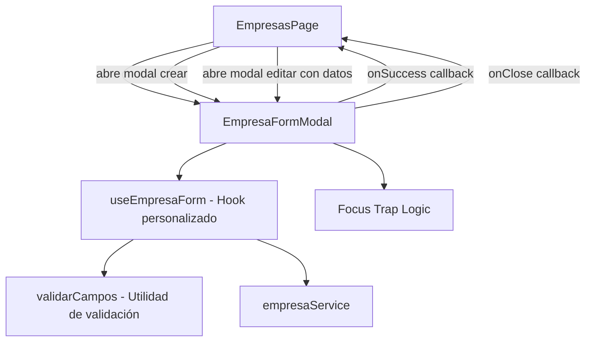
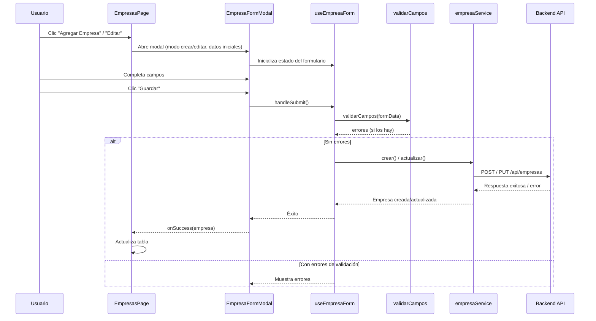

# Documento de Diseño: Formulario Modal de Empresa

## Overview

Este documento describe el diseño técnico del formulario modal para crear y editar empresas en la aplicación frontend. El formulario se implementará como un componente React reutilizable que se abre como un diálogo superpuesto (modal) sobre la página `EmpresasPage`, evitando la navegación a otra ruta.

El diseño se basa en:
- React 19 con TypeScript
- CSS vanilla con variables CSS del sistema de diseño existente
- Los tipos `CrearEmpresaRequest` y `ActualizarEmpresaRequest` ya definidos
- El servicio `empresaService` con métodos `crear()` y `actualizar()` ya implementados
- Sin dependencias adicionales de UI externas

## Architecture

### Diagrama de Componentes



### Flujo de Datos



## Components and Interfaces

### 1. `EmpresaFormModal` — Componente Principal del Modal

**Archivo:** `frontend/src/components/EmpresaFormModal.tsx`

```typescript
interface EmpresaFormModalProps {
  isOpen: boolean;
  modo: 'crear' | 'editar';
  empresaInicial?: Empresa | null;
  onClose: () => void;
  onSuccess: (empresa: Empresa) => void;
}
```

**Responsabilidades:**
- Renderizar el overlay y el contenedor del modal
- Gestionar el focus trap (restringir tabulación al modal)
- Manejar cierre por Escape, clic en overlay y botón cancelar
- Delegar la lógica de formulario al hook `useEmpresaForm`
- Aplicar atributos ARIA de accesibilidad (`role="dialog"`, `aria-modal="true"`, `aria-labelledby`)
- Restaurar el foco al elemento que originó la apertura al cerrarse

### 2. `useEmpresaForm` — Hook Personalizado

**Archivo:** `frontend/src/hooks/useEmpresaForm.ts`

```typescript
interface UseEmpresaFormOptions {
  modo: 'crear' | 'editar';
  empresaInicial?: Empresa | null;
  onSuccess: (empresa: Empresa) => void;
  onClose: () => void;
}

interface UseEmpresaFormReturn {
  formData: EmpresaFormData;
  errores: EmpresaFormErrors;
  errorServidor: string | null;
  submitting: boolean;
  handleChange: (campo: keyof EmpresaFormData, valor: string) => void;
  handleSubmit: () => Promise<void>;
  resetForm: () => void;
}
```

**Responsabilidades:**
- Gestionar el estado del formulario (valores, errores, estado de carga)
- Ejecutar validación de campos antes del envío
- Invocar `empresaService.crear()` o `empresaService.actualizar()` según el modo
- Manejar errores de la API (500, 400, 409, timeout)
- Limpiar errores de campo cuando el usuario corrige valores
- Implementar timeout de 30 segundos con `AbortController`

### 3. `validarCampos` — Función de Validación Pura

**Archivo:** `frontend/src/utils/validarEmpresaForm.ts`

```typescript
function validarCampos(formData: EmpresaFormData): EmpresaFormErrors;
```

**Responsabilidades:**
- Validar que ningún campo esté vacío o contenga solo espacios
- Validar longitud mínima/máxima de cada campo
- Validar formato de teléfono (solo números, guiones y espacios; entre 7 y 15 dígitos)
- Retornar un objeto con mensajes de error por campo (vacío si es válido)

### 4. Integración en `EmpresasPage`

**Modificación de:** `frontend/src/pages/EmpresasPage.tsx`

Se agrega:
- Estado para controlar la visibilidad del modal y el modo (crear/editar)
- Botón "Agregar Empresa" en la cabecera
- Botón "Editar" en cada fila de la tabla
- Callback `onSuccess` para actualizar la tabla sin recargar
- Referencia al botón que abrió el modal para restaurar el foco

## Data Models

### Tipos del Formulario

```typescript
// Estado interno del formulario
interface EmpresaFormData {
  nombre: string;
  direccion: string;
  telefono: string;
}

// Errores de validación por campo
interface EmpresaFormErrors {
  nombre?: string;
  direccion?: string;
  telefono?: string;
}

// Estado del modal en EmpresasPage
interface ModalState {
  isOpen: boolean;
  modo: 'crear' | 'editar';
  empresa: Empresa | null;
}
```

### Tipos Existentes Reutilizados

- `Empresa` — Entidad completa con id, timestamps
- `CrearEmpresaRequest` — Payload para POST: `{ nombre, direccion, telefono }`
- `ActualizarEmpresaRequest` — Payload para PUT: `{ nombre, direccion, telefono }`

### Reglas de Validación

| Campo     | Obligatorio | Min | Max | Formato                                      |
|-----------|:-----------:|:---:|:---:|----------------------------------------------|
| nombre    | ✓           | 2   | 100 | Texto libre                                  |
| direccion | ✓           | 5   | 200 | Texto libre                                  |
| telefono  | ✓           | 7†  | 15† | Solo dígitos, guiones y espacios             |

† La longitud se refiere a dígitos numéricos, no al largo total del string (que puede incluir guiones/espacios).


## Correctness Properties

*Una propiedad es una característica o comportamiento que debe cumplirse en todas las ejecuciones válidas de un sistema — esencialmente, una declaración formal sobre lo que el sistema debe hacer. Las propiedades sirven como puente entre especificaciones legibles por humanos y garantías de correctitud verificables por máquina.*

### Property 1: Rechazo de campos con solo espacios en blanco

*Para cualquier* campo del formulario (nombre, dirección o teléfono) cuyo valor consista exclusivamente en caracteres de espacio en blanco (incluyendo el string vacío), la función `validarCampos` DEBE retornar el mensaje de error "obligatorio" correspondiente a ese campo.

**Validates: Requirements 4.1, 4.2, 4.3**

### Property 2: Datos válidos pasan la validación

*Para cualquier* objeto `EmpresaFormData` donde: nombre tiene entre 2 y 100 caracteres (no solo espacios), dirección tiene entre 5 y 200 caracteres (no solo espacios), y teléfono contiene solo dígitos, guiones y espacios con entre 7 y 15 dígitos numéricos, la función `validarCampos` DEBE retornar un objeto sin errores (todos los campos `undefined`).

**Validates: Requirements 4.1, 4.2, 4.3, 5.1, 5.2, 5.3, 5.4, 5.5**

### Property 3: Validación simultánea de múltiples campos inválidos

*Para cualquier* formulario con N campos inválidos (donde N ≥ 1), la función `validarCampos` DEBE retornar exactamente N mensajes de error, uno por cada campo inválido, en una sola invocación.

**Validates: Requirements 4.4**

### Property 4: Límites de longitud del nombre

*Para cualquier* string no compuesto solo de espacios con longitud menor a 2 o mayor a 100 caracteres, la función `validarCampos` DEBE retornar un error de longitud para el campo nombre.

**Validates: Requirements 5.1, 5.2**

### Property 5: Formato inválido de teléfono

*Para cualquier* string que contenga al menos un carácter que no sea dígito, guión o espacio, la función `validarCampos` DEBE retornar el error "El teléfono solo puede contener números, guiones y espacios".

**Validates: Requirements 5.3**

### Property 6: Cantidad de dígitos del teléfono fuera de rango

*Para cualquier* string compuesto exclusivamente de dígitos, guiones y espacios, pero cuyo número de dígitos sea menor a 7 o mayor a 15, la función `validarCampos` DEBE retornar el error "El teléfono debe tener entre 7 y 15 dígitos".

**Validates: Requirements 5.4**

### Property 7: Límites de longitud de la dirección

*Para cualquier* string no compuesto solo de espacios con longitud menor a 5 o mayor a 200 caracteres, la función `validarCampos` DEBE retornar un error de longitud para el campo dirección.

**Validates: Requirements 5.5**

## Error Handling

### Errores de Validación del Cliente

| Situación | Comportamiento |
|-----------|----------------|
| Campo vacío/solo espacios | Mensaje "es obligatorio" debajo del campo, borde rojo |
| Longitud fuera de rango | Mensaje específico de longitud debajo del campo |
| Formato inválido (teléfono) | Mensaje de formato debajo del campo |
| Múltiples errores | Se muestran todos simultáneamente |
| Usuario corrige un campo | Se re-evalúa solo ese campo y se oculta el error si es válido |

### Errores del Servidor

| Código HTTP | Comportamiento |
|-------------|----------------|
| 400 (validación) | Mapear errores del servidor a campos individuales del formulario |
| 409 (conflicto) | Mostrar "Ya existe una empresa con ese nombre" en la parte superior del formulario |
| 500 (servidor) | Mostrar "Ocurrió un error en el servidor. Intente nuevamente." en la parte superior |
| Timeout (30s) | Mostrar mensaje de tiempo de espera, restaurar botón guardar |

### Estrategia de Manejo de Errores HTTP

El hook `useEmpresaForm` intercepta errores de Axios y los clasifica:

```typescript
try {
  // llamada al servicio
} catch (error) {
  if (axios.isAxiosError(error)) {
    const status = error.response?.status;
    if (status === 400) {
      // Mapear error.response.data.errors a campos
    } else if (status === 409) {
      setErrorServidor('Ya existe una empresa con ese nombre.');
    } else if (status === 500) {
      setErrorServidor('Ocurrió un error en el servidor. Intente nuevamente.');
    }
  } else if (error.name === 'AbortError' || error.code === 'ECONNABORTED') {
    setErrorServidor('La solicitud excedió el tiempo de espera.');
  }
}
```

### Timeout de 30 Segundos

Se implementa mediante la configuración de timeout en la solicitud Axios:

```typescript
const config = { timeout: 30000 };
```

Si la solicitud no se completa en 30 segundos, Axios lanza un error con `code: 'ECONNABORTED'`, que el hook captura para restaurar el estado del botón y mostrar el mensaje correspondiente.

## Testing Strategy

### Enfoque Dual: Tests Unitarios + Tests de Propiedades

#### Tests de Propiedades (Property-Based Testing)

**Librería:** [fast-check](https://github.com/dubzzz/fast-check) — librería PBT para TypeScript/JavaScript.

**Configuración:**
- Mínimo 100 iteraciones por test de propiedad
- Cada test etiquetado con referencia a la propiedad del diseño

**Tests de propiedad a implementar:**

1. **Propiedad 1** — Generador: strings de whitespace (spaces, tabs, newlines) de longitud variable → verificar error "obligatorio" para cada campo
2. **Propiedad 2** — Generador: `EmpresaFormData` con valores dentro de rangos válidos → verificar que no hay errores
3. **Propiedad 3** — Generador: formularios con 1-3 campos inválidos → verificar que retorna exactamente el número correcto de errores
4. **Propiedad 4** — Generador: strings de longitud 1 o > 100 → verificar error de longitud para nombre
5. **Propiedad 5** — Generador: strings con caracteres ilegales mezclados → verificar error de formato de teléfono
6. **Propiedad 6** — Generador: strings de dígitos+guiones+espacios con count de dígitos < 7 o > 15 → verificar error de dígitos
7. **Propiedad 7** — Generador: strings de longitud < 5 o > 200 → verificar error de longitud de dirección

**Tag format:** `Feature: add-empresa-ui-form, Property {N}: {título}`

#### Tests Unitarios (Example-Based)

**Librería:** Vitest + React Testing Library (ya disponibles como dependencias de desarrollo recomendadas)

**Cobertura:**
- Renderizado del modal (estructura DOM, atributos ARIA)
- Interacciones de apertura/cierre (botones, overlay, Escape)
- Precarga de datos en modo edición
- Estados de carga (spinner, botón deshabilitado)
- Integración con `empresaService` (mock de crear/actualizar)
- Manejo de errores del servidor (400, 409, 500, timeout)
- Focus trap y restauración de foco
- Limpieza de errores al modificar campos

#### Tests de Integración

- Flujo completo de creación: abrir modal → completar campos → guardar → verificar actualización de tabla
- Flujo completo de edición: clic editar → verificar datos precargados → modificar → guardar → verificar fila actualizada
- Flujo de error: guardar con error de servidor → verificar que modal permanece abierto

### Estructura de Archivos de Test

```
frontend/src/
├── utils/
│   └── __tests__/
│       └── validarEmpresaForm.property.test.ts   ← Tests de propiedades
├── hooks/
│   └── __tests__/
│       └── useEmpresaForm.test.ts                ← Tests unitarios del hook
├── components/
│   └── __tests__/
│       └── EmpresaFormModal.test.tsx             ← Tests de componente
└── pages/
    └── __tests__/
        └── EmpresasPage.integration.test.tsx     ← Tests de integración
```
