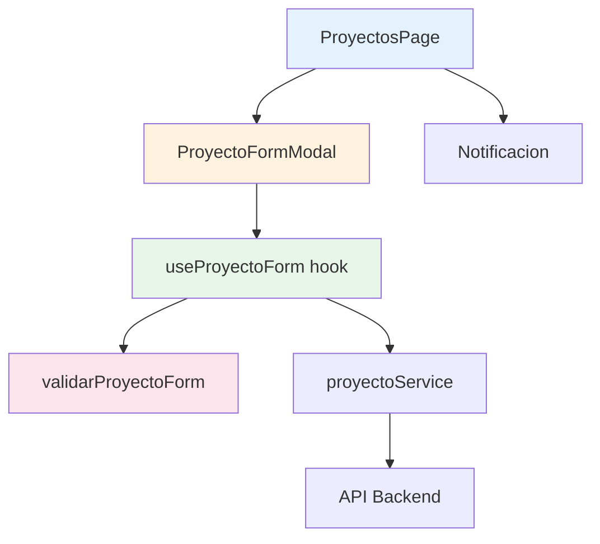
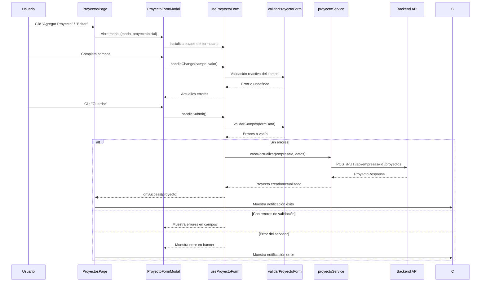

# Documento de Diseño: Formulario UI para Proyecto

## Overview

Este documento describe el diseño técnico del formulario modal para crear y editar proyectos en el frontend React + TypeScript (Vite). Se sigue el patrón arquitectónico ya establecido por `EmpresaFormModal` + `useEmpresaForm`, adaptándolo a los campos del dominio de proyectos (`nombre`, `fechaHabilitacion`, `estadoHabilitacion`). El diseño incluye la actualización de tipos TypeScript para alinearlos con los DTOs del backend .NET 10, un componente modal reutilizable, un hook de gestión de formulario, una utilidad de validación pura, y un componente de notificaciones.

## Architecture

### Diagrama de Componentes



### Diagrama de Flujo de Datos



## Components and Interfaces

### 1. Tipos TypeScript Actualizados (`src/types/proyecto.ts`)

Los tipos actuales están desalineados con el backend. Se reemplazarán completamente:

```typescript
/** Respuesta del listado de proyectos — alineado con ProyectoListResponse del backend */
export interface ProyectoListResponse {
  id: number;
  nombre: string;
  fechaHabilitacion: string; // ISO 8601 YYYY-MM-DD
  estadoHabilitacion: boolean;
}

/** Respuesta completa de un proyecto — alineado con ProyectoResponse del backend */
export interface ProyectoResponse {
  id: number;
  nombre: string;
  fechaHabilitacion: string; // ISO 8601 YYYY-MM-DD
  estadoHabilitacion: boolean;
  empresaId: number;
}

/** Request para crear proyecto — alineado con CrearProyectoRequest del backend */
export interface CrearProyectoRequest {
  nombre: string;
  fechaHabilitacion: string; // ISO 8601 YYYY-MM-DD
  estadoHabilitacion?: boolean;
}

/** Request para actualizar proyecto — alineado con ActualizarProyectoRequest del backend */
export interface ActualizarProyectoRequest {
  nombre?: string;
  fechaHabilitacion?: string; // ISO 8601 YYYY-MM-DD
  estadoHabilitacion?: boolean;
}
```

**Decisión de diseño**: Se usa `ProyectoListResponse` para la tabla (menos campos) y `ProyectoResponse` para operaciones individuales. Esto refleja exactamente los DTOs del backend y evita sobre-fetching.

### 2. ProyectoFormModal (`src/components/ProyectoFormModal.tsx`)

Sigue el mismo patrón estructural de `EmpresaFormModal`:

```typescript
interface ProyectoFormModalProps {
  isOpen: boolean;
  modo: 'crear' | 'editar';
  empresaId: number;
  proyectoInicial?: ProyectoListResponse | null;
  onClose: () => void;
  onSuccess: (proyecto: ProyectoResponse) => void;
}
```

**Campos del formulario:**
- `nombre`: `<input type="text">` con placeholder "Nombre del proyecto", maxLength=100
- `fechaHabilitacion`: `<input type="date">` con min="2000-01-01"
- `estadoHabilitacion`: `<input type="checkbox">` con label "Proyecto habilitado"

**Comportamientos clave:**
- Focus trap con Tab/Shift+Tab
- Auto-focus en primer campo al abrir
- Cierre con Escape, clic en overlay, o botón Cancelar
- Deshabilitación de controles durante envío
- Banner de error del servidor en la parte superior
- Atributos ARIA: `role="dialog"`, `aria-modal="true"`, `aria-labelledby`

**CSS**: Reutiliza las clases de `EmpresaFormModal.css` (`modal-overlay`, `modal-container`, `modal-title`, `modal-form`, `form-field`, `modal-actions`, etc.) importándolas directamente, ya que los estilos son genéricos para modales.

### 3. useProyectoForm Hook (`src/hooks/useProyectoForm.ts`)

```typescript
interface UseProyectoFormOptions {
  modo: 'crear' | 'editar';
  empresaId: number;
  proyectoInicial?: ProyectoListResponse | null;
  onSuccess: (proyecto: ProyectoResponse) => void;
  onClose: () => void;
}

interface UseProyectoFormReturn {
  formData: ProyectoFormData;
  errores: ProyectoFormErrors;
  errorServidor: string | null;
  submitting: boolean;
  handleChange: (campo: keyof ProyectoFormData, valor: string | boolean) => void;
  handleSubmit: () => Promise<void>;
  resetForm: () => void;
}
```

**Estado inicial:**
- Modo crear: `{ nombre: '', fechaHabilitacion: '', estadoHabilitacion: true }`
- Modo editar: Se pre-cargan los valores de `proyectoInicial`

**Lógica de envío:**
- Ejecuta `validarCampos(formData)` antes de enviar
- Modo crear: `proyectoService.crear(empresaId, payload)`
- Modo editar: `proyectoService.actualizar(empresaId, proyectoId, payload)`
- Timeout de 30 segundos configurado en la petición axios
- Manejo de errores por código HTTP (400, 404, 409, 500, red)

**Limpieza de errores:**
- Los errores de servidor se limpian al modificar cualquier campo o al reintentar
- Los errores de validación se re-evalúan por campo en cada cambio

### 4. Validación (`src/utils/validarProyectoForm.ts`)

```typescript
export interface ProyectoFormData {
  nombre: string;
  fechaHabilitacion: string;
  estadoHabilitacion: boolean;
}

export interface ProyectoFormErrors {
  nombre?: string;
  fechaHabilitacion?: string;
}

export function validarCampos(formData: ProyectoFormData): ProyectoFormErrors;
```

**Reglas de validación para `nombre`:**
1. Vacío o solo espacios → "El nombre es obligatorio"
2. Trimmed length < 2 → "El nombre debe tener al menos 2 caracteres"
3. Trimmed length > 100 → "El nombre no puede exceder 100 caracteres"

**Reglas de validación para `fechaHabilitacion`:**
1. Vacío → "La fecha de habilitación es obligatoria"
2. Formato inválido (no YYYY-MM-DD o fecha inexistente) → "La fecha de habilitación debe ser una fecha válida"
3. Antes de 2000-01-01 → "La fecha de habilitación no puede ser anterior al año 2000"
4. Más de 10 años en el futuro → "La fecha de habilitación no puede ser superior a 10 años en el futuro"

**Decisión de diseño**: La validación es una función pura sin efectos secundarios. Esto permite testearla de forma aislada con property-based testing. La validación de fecha usa `Date` parsing nativo y verifica que el resultado no sea `Invalid Date` y que los componentes year/month/day reconstruyan la cadena original (para detectar fechas como 2024-02-30).

### 5. Componente Notificación (`src/components/Notificacion.tsx`)

```typescript
interface NotificacionProps {
  mensaje: string;
  tipo: 'exito' | 'error';
  visible: boolean;
  onClose: () => void;
}
```

**Comportamientos:**
- Se muestra en la parte superior de la página
- Color verde para éxito, rojo para error
- Auto-dismiss después de 4 segundos (timer se cancela si se cierra manualmente)
- Botón de cierre "×"
- `role="alert"` para lectores de pantalla
- Si aparece una nueva notificación mientras otra está visible, se reemplaza y reinicia el timer

**CSS**: Archivo `Notificacion.css` con clases `.notificacion`, `.notificacion--exito`, `.notificacion--error`, `.notificacion__close`.

### 6. ProyectosPage Actualizada (`src/pages/ProyectosPage.tsx`)

**Cambios principales:**
- Agrega estado para el modal: `modalAbierto`, `modoModal`, `proyectoEditar`
- Agrega estado para notificación: `notificacion` (mensaje, tipo, visible)
- Agrega botón "Agregar Proyecto" en el header
- Agrega botón "Editar" en cada fila de la tabla
- Cambia columnas de la tabla a: Nombre, Fecha de Habilitación, Estado, Acciones
- Usa `ProyectoListResponse` en lugar del tipo `Proyecto` actual
- Integra `ProyectoFormModal` y `Notificacion`

**Callbacks:**
- `handleCrearExito(proyecto)`: Agrega al listado, muestra notificación éxito
- `handleEditarExito(proyecto)`: Reemplaza en listado, muestra notificación éxito
- `handleCerrarModal()`: Resetea estado del modal

### 7. Actualización de proyectoService (`src/services/proyectoService.ts`)

**Cambios:**
- Actualizar imports a los nuevos tipos (`ProyectoListResponse`, `ProyectoResponse`, `CrearProyectoRequest`, `ActualizarProyectoRequest`)
- `listar` retorna `ProyectoListResponse[]`
- `obtenerPorId`, `crear`, `actualizar` retornan `ProyectoResponse`
- Agregar parámetro de config opcional para timeout: `{ timeout: 30000 }`

## Data Models

### Mapeo Backend → Frontend

| Backend (PascalCase) | Frontend (camelCase) | Tipo |
|---|---|---|
| `Id` | `id` | `number` |
| `Nombre` | `nombre` | `string` |
| `FechaHabilitacion` | `fechaHabilitacion` | `string` (ISO 8601) |
| `EstadoHabilitacion` | `estadoHabilitacion` | `boolean` |
| `EmpresaId` | `empresaId` | `number` |

### Estructura de Archivos

```
frontend/src/
├── components/
│   ├── ProyectoFormModal.tsx    (nuevo)
│   ├── Notificacion.tsx         (nuevo)
│   └── Notificacion.css         (nuevo)
├── hooks/
│   └── useProyectoForm.ts       (nuevo)
├── pages/
│   └── ProyectosPage.tsx        (modificado)
├── services/
│   └── proyectoService.ts       (modificado)
├── types/
│   └── proyecto.ts              (reemplazado)
└── utils/
    └── validarProyectoForm.ts   (nuevo)
```

## Correctness Properties

*Una propiedad es una característica o comportamiento que debe mantenerse verdadero en todas las ejecuciones válidas de un sistema — esencialmente, una declaración formal sobre lo que el sistema debe hacer. Las propiedades sirven como puente entre especificaciones legibles por humanos y garantías de corrección verificables por máquina.*

### Property 1: Validación completa de nombre

*Para cualquier* cadena de texto, `validarNombre` debe retornar el error correcto basado en la longitud trimmed: si es 0 (vacío/solo espacios) debe retornar "El nombre es obligatorio"; si es 1 debe retornar "El nombre debe tener al menos 2 caracteres"; si es mayor a 100 debe retornar "El nombre no puede exceder 100 caracteres"; si está entre 2 y 100 (inclusive) debe retornar `undefined`.

**Validates: Requirements 4.1, 5.1, 5.2**

### Property 2: Validación completa de fecha de habilitación

*Para cualquier* cadena de texto, `validarFechaHabilitacion` debe retornar: "La fecha de habilitación es obligatoria" si es vacía; "La fecha de habilitación debe ser una fecha válida" si no es un formato ISO válido o representa una fecha inexistente; "La fecha de habilitación no puede ser anterior al año 2000" si la fecha es anterior a 2000-01-01; "La fecha de habilitación no puede ser superior a 10 años en el futuro" si la fecha supera 10 años desde hoy; y `undefined` si la fecha es válida y está dentro del rango permitido.

**Validates: Requirements 4.2, 5.3, 5.4, 5.5**

### Property 3: Mapeo de errores de servidor a campos del formulario

*Para cualquier* diccionario de errores retornado por el servidor (código 400), las claves que coincidan con campos conocidos del formulario (`nombre`, `fechaHabilitacion`) deben mostrarse como errores debajo de sus campos respectivos, y las claves no reconocidas deben mostrarse en el banner de error superior del formulario.

**Validates: Requirement 8.3**

### Property 4: Reset de estado del formulario al cerrar

*Para cualquier* conjunto de datos ingresados en el formulario sin guardar, al cerrar el modal y reabrirlo en modo creación los campos deben estar en su estado inicial (nombre vacío, fecha vacía, estado habilitado true); y al reabrirlo en modo edición deben contener los datos originales del proyecto seleccionado.

**Validates: Requirement 9.4**

## Error Handling

### Errores de Validación Client-Side
- Se ejecutan de forma síncrona antes del envío
- Se muestran inline debajo de cada campo con clase `.field-error-message`
- Se re-evalúan reactivamente al modificar cada campo
- Bloquean el envío mientras existan

### Errores del Servidor
| Código | Comportamiento |
|--------|---------------|
| 400 (con `errors`) | Mapea errores a campos; muestra no-reconocidos en banner |
| 404 | Banner: "La empresa asociada no fue encontrada." |
| 409 | Banner: mensaje de la respuesta (`response.data.mensaje`) |
| 500 | Banner: "Ocurrió un error en el servidor. Intente nuevamente." |
| Red/sin respuesta | Banner: "No se pudo conectar con el servidor. Verifique su conexión e intente nuevamente." |
| Timeout (30s) | Banner: timeout message + notificación de error |

### Recuperación
- El modal permanece abierto con datos intactos
- El botón "Guardar" se rehabilita
- Los errores de servidor se limpian al modificar un campo o reintentar

## Testing Strategy

### Tests Unitarios (Vitest + React Testing Library)

Cubren ejemplos concretos, edge cases y comportamientos de UI:

- **ProyectoFormModal**: Renderizado correcto en modo crear/editar, atributos ARIA, focus trap, cierre por Escape/overlay/Cancelar, deshabilitación durante envío
- **useProyectoForm**: Inicialización de estado, handleChange, handleSubmit con mock de servicio, manejo de errores por código HTTP
- **Notificacion**: Renderizado con tipo éxito/error, auto-dismiss a 4s, cierre manual, reemplazo de notificaciones
- **ProyectosPage integrada**: Flujo completo crear/editar, actualización de tabla

### Tests de Propiedades (Vitest + fast-check)

Verifican propiedades universales con mínimo 100 iteraciones:

- **Property 1**: Generador de strings arbitrarios → `validarNombre` retorna el error correcto según longitud trimmed
  - Tag: `Feature: add-proyecto-ui-form, Property 1: Validación completa de nombre`
- **Property 2**: Generador de strings arbitrarios (válidos, inválidos, fechas fuera de rango) → `validarFechaHabilitacion` retorna el error correcto
  - Tag: `Feature: add-proyecto-ui-form, Property 2: Validación completa de fecha de habilitación`
- **Property 3**: Generador de diccionarios con claves aleatorias → mapeo correcto a campos vs banner
  - Tag: `Feature: add-proyecto-ui-form, Property 3: Mapeo de errores de servidor a campos`
- **Property 4**: Generador de datos de formulario aleatorios → reset al cerrar preserva invariante de estado inicial
  - Tag: `Feature: add-proyecto-ui-form, Property 4: Reset de estado del formulario al cerrar`

**Configuración**: Cada property test ejecuta mínimo 100 iteraciones usando `fc.assert(fc.property(...), { numRuns: 100 })`.

### Tests de Integración

- Flujo completo con API mockeada (MSW o axios mock): crear proyecto → verificar llamada POST → verificar tabla actualizada
- Flujo editar proyecto → PUT → tabla actualizada
- Manejo de errores HTTP reales simulados

### Cobertura Mínima Esperada

- Validación: 100% (funciones puras, fácilmente testeables)
- Hook: 90%+ (lógica principal cubierta, edge cases incluidos)
- Componentes: 85%+ (interacciones principales y a11y)
