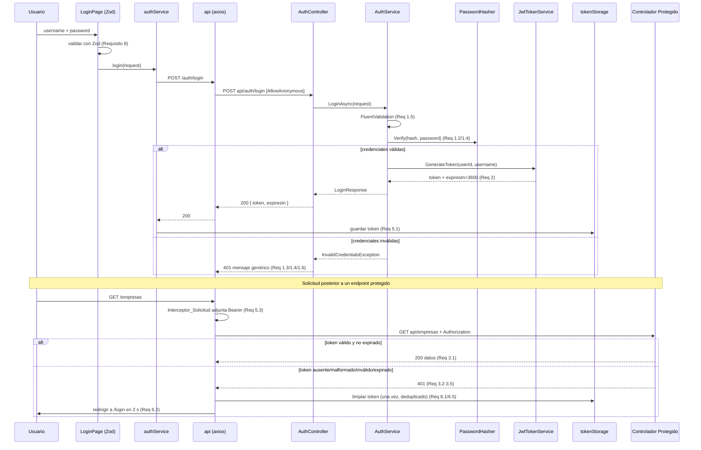

# Documento de Diseño

## Overview

Esta funcionalidad incorpora autenticación basada en usuario/contraseña con emisión y validación de tokens JWT a la aplicación CompanyProjectManagement, respetando la arquitectura por capas existente en el backend (.NET `net10.0`) y los patrones del cliente React 19 + TypeScript + Vite.

El diseño se organiza en dos flujos complementarios:

- **Backend (Sistema_Autenticacion):** expone `POST api/auth/login`, verifica credenciales contra el `Almacen_Usuarios`, emite un JWT firmado con expiración de 60 minutos y protege los controladores de Dashboard, Empresa y Proyecto mediante autorización basada en JWT Bearer. La validación de la configuración de firma se realiza en el arranque (fail-fast).
- **Cliente (Cliente_Web):** almacena el token, lo adjunta automáticamente a cada solicitud vía interceptor de axios, maneja respuestas `401` (limpieza de sesión + redirección deduplicada), protege rutas con un `ProtectedRoute` (`Guardia_Ruta`) y valida el `Formulario_Login` con Zod.

### Decisiones de diseño clave

| Decisión | Justificación | Requisitos |
| --- | --- | --- |
| Reutilizar la arquitectura por capas (Domain / Application / Api / Infrastructure) | Coherencia con `Empresa`/`Proyecto`; mínimo impacto en convenciones | 1, 2, 3, 4 |
| Autenticación JWT Bearer nativa de ASP.NET Core (`Microsoft.AspNetCore.Authentication.JwtBearer`) | Validación de firma/expiración estándar y probada; evita implementación propia | 2, 3 |
| Hash de contraseña con `Rfc2898DeriveBytes` (PBKDF2) con sal por usuario | Algoritmo con sal, portable entre proveedores de BD, sin dependencias externas | 4 |
| Sección `Jwt` en `appsettings.json`; `SecretKey` desde user-secrets/entorno en producción | Evita comprometer la clave en el repositorio; validación al arranque | 2 |
| Validación de configuración fail-fast en `Program.cs` | Impedir el arranque si falta `SecretKey`, `Issuer` o `Audience` | 2.5, 2.6 |
| Excepción de dominio `InvalidCredentialsException` → 401 con mensaje genérico | Impide la enumeración de usuarios (mismo mensaje para usuario/contraseña inválidos) | 1.3, 1.4, 1.6 |
| `localStorage` como `Almacen_Token_Cliente` | Persistencia tras recarga y reapertura de pestaña | 5.1 |
| Interceptores de axios (solicitud + respuesta) sobre la instancia `api` existente | Adjuntar `Bearer` y manejar `401` de forma centralizada y deduplicada | 5.3, 5.4, 6 |
| Validación con Zod en modo `onChange` con debounce ~500 ms | Retroalimentación inmediata y revalidación de campos con error | 8 |

## Architecture

### Componentes del backend por capa

```
CompanyProjectManagement.Domain
  Entities/            → Usuario (nueva)
  Repositories/        → IUsuarioRepository (nueva)
  Exceptions/          → InvalidCredentialsException (nueva)

CompanyProjectManagement.Application
  DTOs/Requests/       → LoginRequest (nueva)
  DTOs/Responses/      → LoginResponse (nueva)
  Services/            → IAuthService/AuthService, ITokenService/JwtTokenService,
                         IPasswordHasher/PasswordHasher (nuevas)
  Validators/          → LoginRequestValidator (nueva)
  Options/             → JwtOptions (nueva)

CompanyProjectManagement.Api
  Controllers/         → AuthController (nueva); [Authorize] en Dashboard/Empresa/Proyecto
  Middleware/          → GlobalExceptionMiddleware (extendido para 401)
  Program.cs           → AddAuthentication(JwtBearer) + AddAuthorization,
                         validación fail-fast de JwtOptions, orden Use* correcto

CompanyProjectManagement.Infrastructure(.SqlServer/.PostgreSQL)
  Data/                → UsuarioRepository, configuración EF de Usuario,
                         migración + seed de usuario administrador inicial
```

### Componentes del cliente

```
frontend/src
  services/api.ts          → + Interceptor_Solicitud (Bearer) y ampliación del
                             Interceptor_Respuesta (manejo de 401 deduplicado)
  services/authService.ts  → login() (nueva)
  utils/tokenStorage.ts    → Almacen_Token_Cliente sobre localStorage (nueva)
  schemas/loginSchema.ts   → Validador_Login (Zod) (nueva)
  hooks/useAuth.ts         → estado de autenticación (nueva)
  context/AuthContext.tsx  → AuthContext / AuthProvider (nueva)
  components/ProtectedRoute.tsx → Guardia_Ruta (nueva)
  pages/LoginPage.tsx      → Formulario_Login (nueva)
  App.tsx                  → ruta pública /login + rutas protegidas
```

### Flujo de inicio de sesión y solicitud protegida



## Components and Interfaces

### Backend — Domain

**`Usuario` (Entities/Usuario.cs)** — clase POCO siguiendo el patrón de `Empresa`:

```csharp
public class Usuario
{
    public int Id { get; set; }
    public string Username { get; set; } = string.Empty;   // único, 3-64 chars
    public string PasswordHash { get; set; } = string.Empty; // hash derivado (PBKDF2)
    public string PasswordSalt { get; set; } = string.Empty; // sal en Base64
}
```

**`IUsuarioRepository` (Repositories/IUsuarioRepository.cs)** — mismo estilo async que `IEmpresaRepository`:

```csharp
public interface IUsuarioRepository
{
    Task<Usuario?> ObtenerPorUsernameAsync(string username);
    Task<bool> ExisteUsernameAsync(string username);
    Task<Usuario> CrearAsync(Usuario usuario);
}
```

**`InvalidCredentialsException` (Exceptions/InvalidCredentialsException.cs)** — sigue el patrón de las excepciones existentes; mapea a HTTP 401 con mensaje genérico:

```csharp
// Constructor por defecto con mensaje genérico "Usuario o contraseña incorrectos."
public class InvalidCredentialsException : Exception { /* ... */ }
```

### Backend — Application

**`JwtOptions` (Options/JwtOptions.cs):**

```csharp
public class JwtOptions
{
    public const string SectionName = "Jwt";
    public string SecretKey { get; set; } = string.Empty;
    public string Issuer { get; set; } = string.Empty;
    public string Audience { get; set; } = string.Empty;
    public int ExpirationMinutes { get; set; } = 60;
}
```

**`IPasswordHasher` / `PasswordHasher` (Services/):** algoritmo con sal (PBKDF2 vía `Rfc2898DeriveBytes`, SHA-256, iteraciones fijas).

```csharp
public interface IPasswordHasher
{
    (string Hash, string Salt) Hash(string password);      // Req 4.2
    bool Verify(string password, string hash, string salt); // Req 4.3
}
```

**`ITokenService` / `JwtTokenService` (Services/):** genera y firma el JWT.

```csharp
public interface ITokenService
{
    // Req 2.1-2.3, 2.7, 2.8: devuelve token firmado + segundos de vigencia
    TokenResult GenerateToken(string userId, string username);
}
public record TokenResult(string Token, int ExpiresInSeconds);
```

- Firma HMAC-SHA256 con `SecretKey` (Req 2.1).
- `exp = now + ExpirationMinutes` (60 min; tolerancia ≤ 1 s respecto a la emisión) (Req 2.2).
- Claims: `sub`/`userId` no vacío y `username`/`unique_name` no vacío (Req 2.3).
- Si `userId` o `username` están vacíos → lanza error sin emitir token (Req 2.7).
- Si la firma falla → lanza error sin emitir token (Req 2.8).

**`IAuthService` / `AuthService` (Services/):** orquesta la verificación de credenciales, inyectando `IUsuarioRepository`, `IPasswordHasher`, `ITokenService` y `IValidator<LoginRequest>` (mismo patrón de constructor que `EmpresaService`).

```csharp
public interface IAuthService
{
    Task<LoginResponse> LoginAsync(LoginRequest request); // Req 1
}
```

Lógica de `LoginAsync`:
1. `FluentValidation` sobre `LoginRequest`; si falla → `ValidationException` → 400 con campo infractor (Req 1.5).
2. `ObtenerPorUsernameAsync`; si no existe → `InvalidCredentialsException` (Req 1.3).
3. `Verify`; si falla → `InvalidCredentialsException` (Req 1.4).
4. `GenerateToken` → `LoginResponse` (Req 1.2).

**`AuthController` (Api/Controllers/AuthController.cs):** mismo estilo que `EmpresaController`.

```csharp
[ApiController]
[Route("api/auth")]
public class AuthController : ControllerBase
{
    [HttpPost("login")]
    [AllowAnonymous]
    public async Task<IActionResult> Login([FromBody] LoginRequest request)
        => Ok(await _authService.LoginAsync(request)); // 200 + LoginResponse
}
```

### Backend — Program.cs (autenticación y fail-fast)

- Enlazar y validar `JwtOptions` antes de `builder.Build()`; si `SecretKey`, `Issuer` o `Audience` están ausentes → lanzar excepción con mensaje claro que impida el arranque (Req 2.5, 2.6).
- `AddAuthentication(JwtBearerDefaults).AddJwtBearer(...)` con `TokenValidationParameters` (valida emisor, audiencia, vida y firma; `ClockSkew = TimeSpan.Zero`) (Req 3.1-3.5).
- `AddAuthorization()`.
- Registrar servicios como `Scoped`: `IUsuarioRepository`, `IAuthService`, `ITokenService`, `IPasswordHasher`.
- `AddValidatorsFromAssemblyContaining` ya recoge `LoginRequestValidator`.
- Orden del pipeline: `UseAuthentication()` → `UseAuthorization()` (antes de `MapControllers`).
- `[Authorize]` a nivel de clase en `DashboardController`, `EmpresaController`, `ProyectoController` (Req 3.7); `[AllowAnonymous]` en `AuthController.Login` (Req 3.6).

### Cliente — módulos

**`utils/tokenStorage.ts` (Almacen_Token_Cliente):**

```ts
export const tokenStorage = {
  get(): string | null,           // Req 5.4
  set(token: string): boolean,    // false si falla persistencia (Req 5.2)
  clear(): void,                  // Req 5.5, 6.1
};
```

**`services/authService.ts`:**

```ts
export const authService = {
  login: (request: LoginRequest): Promise<LoginResponse> =>
    api.post('/auth/login', request).then(r => r.data), // Req 8.5
};
```

**`services/api.ts` (interceptores):**
- *Interceptor_Solicitud:* si `tokenStorage.get()` existe, añade `Authorization: Bearer <token>`; si no, envía sin cabecera (Req 5.3, 5.4).
- *Interceptor_Respuesta (ampliado):* ante `401`, ejecuta limpieza + redirección **una sola vez** mediante una bandera de módulo (`isHandling401`) para deduplicar respuestas concurrentes; programa la redirección a `/login` dentro de 2 s y rechaza las promesas en curso (Req 6.1-6.5).

**`context/AuthContext.tsx` + `hooks/useAuth.ts`:** exponen `isAuthenticated`, `login`, `logout` (limpia token, Req 5.5).

**`components/ProtectedRoute.tsx` (Guardia_Ruta):** si no hay token → `<Navigate to="/login" />` sin renderizar hijos (Req 7.1, 7.3); con token → renderiza `<Outlet/>` (Req 7.2).

**`pages/LoginPage.tsx` (Formulario_Login):** valida con `loginSchema` en modo `onChange` con debounce ~500 ms (Req 8.6); si un usuario autenticado la visita, redirige a la ruta protegida por defecto (Req 7.5).

**`schemas/loginSchema.ts` (Validador_Login, Zod):** `username` 3-50 (no solo espacios), `password` 8-64 (Req 8.1-8.4).

**`App.tsx`:** añade `<Route path="/login" element={<LoginPage/>} />` (pública, Req 7.4) y envuelve la rama `/` con `ProtectedRoute`.

## Data Models

### Entidad `Usuario` y persistencia EF Core

| Campo | Tipo | Restricciones |
| --- | --- | --- |
| `Id` | `int` | PK, identidad |
| `Username` | `string` | Único (índice único), requerido, 3-64 (Req 4.1) |
| `PasswordHash` | `string` | Requerido (Req 4.2) |
| `PasswordSalt` | `string` | Requerido, Base64 (Req 4.2) |

- Configuración EF (`IEntityTypeConfiguration<Usuario>` o `OnModelCreating`) replicada para **SqlServer** y **PostgreSQL**, con índice único en `Username`.
- Migración inicial por proveedor + **seed** de un usuario administrador (username configurable; hash/sal generados con `PasswordHasher`, nunca contraseña en texto plano).
- Al persistir un `Username` duplicado → `DuplicateIdentificationException` (409, Req 4.6); fuera de rango o vacío → `ValidationException` (400, Req 4.7).

### DTOs de aplicación

```csharp
// DTOs/Requests/LoginRequest.cs — Req 1.1
public record LoginRequest(string Username, string Password);

// DTOs/Responses/LoginResponse.cs — Req 1.2
public record LoginResponse(string Token, int ExpiresIn); // ExpiresIn = 3600
```

`LoginRequestValidator` (backend, Req 1.5): `Username` y `Password` no vacíos y longitud 1-256; mensajes que identifican el campo infractor. (La validación de negocio 3-64/8-64 más estricta vive en el `Validador_Login` del cliente, Req 8.)

### Configuración JWT (`appsettings.json`)

```json
"Jwt": {
  "Issuer": "CompanyProjectManagement",
  "Audience": "CompanyProjectManagementClient",
  "ExpirationMinutes": 60,
  "SecretKey": ""
}
```

- `SecretKey` se deja vacío en el repositorio; en desarrollo se provee vía `dotnet user-secrets` y en producción vía variable de entorno. Comentario explícito en el diseño: **no comprometer la clave**.

### Modelos del cliente

```ts
// types/auth.ts
export interface LoginRequest { username: string; password: string; }
export interface LoginResponse { token: string; expiresIn: number; }
```

- `Almacen_Token_Cliente`: clave `localStorage` (p. ej. `auth_token`) con el JWT en crudo (Req 5.1).
- `loginSchema` (Zod): `username: z.string().trim().min(3).max(50)`, `password: z.string().min(8).max(64)` con mensajes en español (Req 8.1-8.4).

## Correctness Properties

*Una propiedad es una característica o comportamiento que debe cumplirse en todas las ejecuciones válidas de un sistema; esencialmente, un enunciado formal sobre lo que el sistema debe hacer. Las propiedades sirven de puente entre las especificaciones legibles por humanos y las garantías de correctitud verificables por máquina.*

Estas propiedades se derivan del prework anterior. Solo se incluyen los criterios clasificados como PROPERTY (o condición de error generalizable). Los criterios de infraestructura/configuración (INTEGRATION, SMOKE) y los efectos de UI concretos (EXAMPLE, EDGE_CASE) se cubren en la Estrategia de Pruebas, no aquí.

### Property 1: Round-trip de firma del token

*Para cualquier* par (userId, username) no vacíos, un token generado por `JwtTokenService` con la `SecretKey` configurada se valida correctamente con esa misma clave y es rechazado al validarse con una clave distinta.

**Validates: Requirements 2.1**

### Property 2: Vigencia del token dentro de la tolerancia

*Para cualquier* (userId, username) no vacíos, en el token generado la diferencia `exp - iat` está dentro de [3600 − 1, 3600] segundos, y `LoginResponse.ExpiresIn` es igual a 3600.

**Validates: Requirements 1.2, 2.2**

### Property 3: Round-trip de claims

*Para cualquier* (userId, username) no vacíos, el token decodificado contiene un claim de identificador de usuario igual a `userId` y un claim de nombre de usuario igual a `username`.

**Validates: Requirements 2.3**

### Property 4: Datos de usuario vacíos impiden la emisión

*Para cualquier* entrada donde `userId` o `username` sean vacíos o compuestos solo por espacios, `JwtTokenService.GenerateToken` lanza un error y no devuelve un token.

**Validates: Requirements 2.7**

### Property 5: Credenciales inválidas producen 401

*Para cualquier* solicitud de login cuyo `username` no exista en el `Almacen_Usuarios`, o cuya contraseña no coincida con el hash almacenado del usuario existente, `AuthService.LoginAsync` lanza `InvalidCredentialsException` (que mapea a HTTP 401) y no emite token.

**Validates: Requirements 1.3, 1.4**

### Property 6: Mensaje de credenciales inválidas indistinguible

*Para cualquier* par de fallos de autenticación (uno por usuario inexistente y otro por contraseña incorrecta), el mensaje devuelto es idéntico y no revela cuál de los dos factores falló.

**Validates: Requirements 1.6**

### Property 7: Rechazo de entradas de login fuera de límites

*Para cualquier* `LoginRequest` con `username` o `password` ausente/vacío o de longitud mayor a 256, `LoginRequestValidator` reporta el fallo (HTTP 400) e identifica el campo infractor (`username` o `password`).

**Validates: Requirements 1.5**

### Property 8: El hash no expone la contraseña en claro

*Para cualquier* contraseña, `PasswordHasher.Hash` produce un par (hash, sal) no vacío en el que el hash no es igual a la contraseña en texto plano ni la contiene.

**Validates: Requirements 4.2**

### Property 9: Round-trip de verificación de contraseña

*Para cualquier* contraseña `pw`, `Verify(pw, Hash(pw))` es verdadero; y *para cualquier* par de contraseñas distintas `pw != pw'`, `Verify(pw', Hash(pw))` es falso.

**Validates: Requirements 4.3**

### Property 10: Validación del rango de nombre de usuario en persistencia

*Para cualquier* `username` vacío o de longitud fuera de [3, 64], la creación de `Usuario` se rechaza con un error de validación y no se persiste.

**Validates: Requirements 4.7**

### Property 11: Adjunto condicional de la cabecera Bearer

*Para cualquier* estado del `Almacen_Token_Cliente`, la configuración de la solicitud producida por el `Interceptor_Solicitud` incluye la cabecera `Authorization` con el valor exacto `Bearer <token>` si y solo si existe un token almacenado no vacío; en ausencia de token, la solicitud no lleva cabecera `Authorization`.

**Validates: Requirements 5.3, 5.4, 5.5**

### Property 12: Deduplicación de manejo de 401 concurrentes

*Para cualquier* cantidad n ≥ 1 de respuestas HTTP 401 procesadas concurrentemente por el `Interceptor_Respuesta`, la eliminación del token y la redirección a `/login` se ejecutan exactamente una vez.

**Validates: Requirements 6.5**

### Property 13: El Guardia_Ruta protege según la presencia de token

*Para cualquier* estado de autenticación, el `Guardia_Ruta` (`ProtectedRoute`) renderiza el contenido protegido si y solo si existe un token almacenado; en ausencia de token redirige a `/login` sin renderizar el contenido protegido.

**Validates: Requirements 7.1, 7.2**

### Property 14: El esquema de login es válido solo dentro de los límites

*Para cualquier* par (username, password), `loginSchema` (Zod) considera la entrada válida si y solo si `username` (tras recorte) tiene entre 3 y 50 caracteres y `password` tiene entre 8 y 64 caracteres; en cualquier otro caso es inválida con un mensaje asociado al campo infractor.

**Validates: Requirements 8.1, 8.2, 8.3, 8.4**

## Error Handling

### Backend — mapeo de excepciones (GlobalExceptionMiddleware)

El middleware existente se **extiende** para mapear las nuevas excepciones, conservando el cuerpo `ErrorResponse { Mensaje, Errores? }`:

| Excepción / situación | HTTP | Cuerpo | Requisitos |
| --- | --- | --- | --- |
| `FluentValidation.ValidationException` (login) | 400 | `Mensaje` + `Errores` por campo (`username`/`password`) | 1.5 |
| `InvalidCredentialsException` | 401 | `Mensaje` genérico ("Usuario o contraseña incorrectos.") | 1.3, 1.4, 1.6 |
| `DuplicateIdentificationException` (username duplicado) | 409 | `Mensaje` de conflicto | 4.6 |
| `ValidationException` (username fuera de rango) | 400 | `Mensaje` + `Errores` | 4.7 |

**Rechazos de autenticación del middleware JWT (Req 3.2-3.5):** los produce el middleware `UseAuthentication`/`UseAuthorization` de ASP.NET Core antes de llegar a `GlobalExceptionMiddleware`. Devuelven `401 Unauthorized`. Se puede añadir un `JwtBearerEvents.OnChallenge` para uniformar el cuerpo del 401 con `ErrorResponse` e indicar el motivo (cabecera ausente, malformada, firma inválida o expirado).

**Fail-fast de configuración (Req 2.5, 2.6):** la validación de `JwtOptions` se ejecuta en `Program.cs` antes de `app.Run()`; si `SecretKey`, `Issuer` o `Audience` faltan, se lanza una excepción con un mensaje que nombra el parámetro ausente, impidiendo el arranque.

**Errores del `TokenService` (Req 2.7, 2.8):** datos de usuario vacíos o fallo de firma lanzan una excepción específica (p. ej. `InvalidOperationException`/excepción de firma) sin emitir token.

### Cliente — manejo de 401 y almacenamiento

- *Interceptor_Respuesta:* ante `401`, ejecuta `tokenStorage.clear()` y programa la redirección a `/login`. Una bandera de módulo (`isHandling401`) garantiza una única ejecución ante 401 concurrentes (Req 6.1, 6.5) y las promesas en curso se rechazan para no aplicar su resultado al estado (Req 6.4). La redirección ocurre dentro de 2 s (Req 6.2). Si `clear()` falla, se fuerza igualmente el estado no autenticado y la redirección (Req 6.3).
- *Almacen_Token_Cliente:* `set` captura errores de `localStorage` y devuelve `false`; el `Cliente_Web` descarta el token, mantiene no autenticado y muestra un mensaje (Req 5.2).
- *Guardia_Ruta:* token inválido/expirado detectado (o `401` derivado) → `clear()` + redirección (Req 7.3).

## Testing Strategy

Enfoque dual (pruebas unitarias/de ejemplo + pruebas basadas en propiedades) más pruebas de integración con `WebApplicationFactory` para el pipeline de autenticación.

### Pruebas basadas en propiedades (PBT)

- **Backend:** biblioteca **FsCheck** (integrada con xUnit vía `FsCheck.Xunit`), mínimo **100 iteraciones** por propiedad. Aplica a la lógica pura: `PasswordHasher`, `JwtTokenService` y la lógica de `AuthService`/`LoginRequestValidator` (con repositorio en memoria/mock). No se implementa PBT desde cero.
- **Frontend:** biblioteca **fast-check** (ya presente) + Vitest, mínimo **100 iteraciones**. Aplica a `loginSchema`, `Interceptor_Solicitud`, deduplicación de 401 y `ProtectedRoute`.
- Cada prueba de propiedad debe etiquetarse con un comentario que referencie la propiedad del diseño, con el formato:
  **Feature: authentication-login-jwt, Property {número}: {texto de la propiedad}**

Cobertura de propiedades:

| Propiedad | Ubicación | Biblioteca |
| --- | --- | --- |
| 1 Round-trip de firma | `JwtTokenService` (backend) | FsCheck |
| 2 Vigencia del token | `JwtTokenService` (backend) | FsCheck |
| 3 Round-trip de claims | `JwtTokenService` (backend) | FsCheck |
| 4 Datos vacíos impiden emisión | `JwtTokenService` (backend) | FsCheck |
| 5 Credenciales inválidas → 401 | `AuthService` (backend, repo en memoria) | FsCheck |
| 6 Mensaje indistinguible | `AuthService` (backend) | FsCheck |
| 7 Rechazo de entradas fuera de límites | `LoginRequestValidator` (backend) | FsCheck |
| 8 Hash no expone contraseña | `PasswordHasher` (backend) | FsCheck |
| 9 Round-trip de verificación | `PasswordHasher` (backend) | FsCheck |
| 10 Rango de username en persistencia | validación de creación de `Usuario` | FsCheck |
| 11 Adjunto condicional de Bearer | `Interceptor_Solicitud` (frontend) | fast-check |
| 12 Deduplicación de 401 | `Interceptor_Respuesta` (frontend) | fast-check |
| 13 Guardia_Ruta según token | `ProtectedRoute` (frontend) | fast-check |
| 14 Validez del esquema por límites | `loginSchema` (frontend) | fast-check |

### Pruebas de integración (WebApplicationFactory)

Usan el `public partial class Program { }` existente. Configuran `Jwt:SecretKey/Issuer/Audience` de prueba y un almacén de usuarios sembrado.

- `POST api/auth/login` responde a la ruta (Req 1.1) y con credenciales válidas devuelve 200 + token (Req 1.2).
- Endpoint protegido con Bearer válido → 200 (Req 3.1).
- Sin cabecera → 401 (Req 3.2); cabecera malformada / token vacío → 401 (Req 3.3); firma inválida → 401 (Req 3.4); token expirado (con `ClockSkew=0`) → 401 (Req 3.5).
- `api/auth/login` accesible sin token (Req 3.6); `Dashboard`, `Empresa`, `Proyecto` sin token → 401 (Req 3.7).
- Repositorio: crear + recuperar usuario existente (Req 4.4); username inexistente → null sin crear (Req 4.5); username duplicado → 409 preservando el existente (Req 4.6); índice único 3-64 (Req 4.1).

### Pruebas de arranque / configuración (smoke)

- Construir el host sin `Jwt:SecretKey` → el arranque falla con mensaje que menciona la clave (Req 2.5).
- Sin `Jwt:Issuer` o `Jwt:Audience` → el arranque falla nombrando el parámetro (Req 2.6).
- `JwtTokenService` toma los valores desde `JwtOptions` inyectado (Req 2.4).

### Pruebas de ejemplo / unitarias (frontend, Testing Library + Vitest)

- `tokenStorage`: `set`→`get` round-trip (Req 5.1); `set` con `localStorage` que lanza → `false`, sin token (Req 5.2).
- Interceptor de respuesta: 401 llama a `clear` (Req 6.1) y redirige a `/login` dentro de 2 s con timers falsos (Req 6.2); `clear` que lanza → sigue no autenticado y redirige (Req 6.3); resultado de solicitud en curso descartado (Req 6.4).
- `ProtectedRoute`: sin token redirige y no renderiza contenido (Req 7.1); token inválido → `clear` + redirección (Req 7.3).
- Rutas: `/login` accesible sin token (Req 7.4); usuario autenticado en `/login` → redirige a la ruta protegida por defecto (Req 7.5).
- `LoginPage`: datos válidos → invoca `authService.login` a `api/auth/login` (Req 8.5); password vacía → inválida (Req 8.2); revalidación de un campo con error dentro de 500 ms con timers falsos (Req 8.6).
- `JwtTokenService` (backend, ejemplo): `SecretKey` inválida para HMAC → lanza sin emitir token (Req 2.8).

### Dependencias de prueba a incorporar

- **Backend:** paquetes `Microsoft.AspNetCore.Authentication.JwtBearer` (producción), `Microsoft.AspNetCore.Mvc.Testing`, `FsCheck.Xunit` (pruebas).
- **Frontend:** añadir `zod` a `dependencies` de `package.json`; `fast-check`, `vitest` y `@testing-library/react` ya están disponibles.
