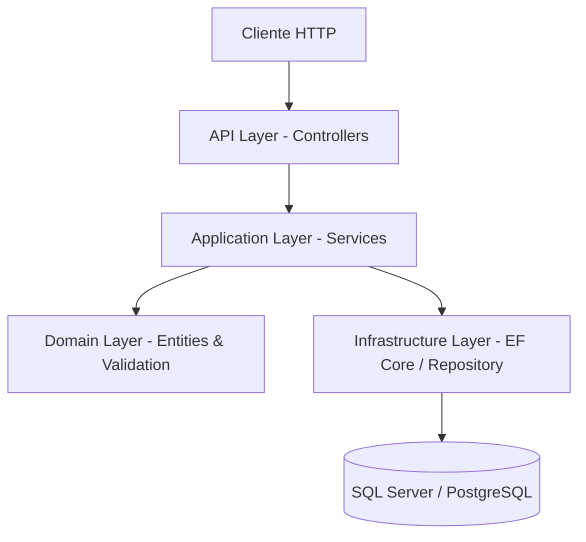

# Documento de Diseño: Administración de Empresas y Proyectos

## Overview

Este documento describe el diseño técnico de una API REST en .NET 10 para la administración de empresas y sus proyectos asociados. El sistema implementa operaciones CRUD completas para ambas entidades, con validación exhaustiva de campos, integridad referencial y mensajes de error descriptivos.

La arquitectura sigue un patrón de capas limpio (Clean Architecture) con separación clara entre la lógica de negocio, la capa de acceso a datos y la capa de presentación (API).

## Architecture



### Capas del Sistema

1. **API Layer (Presentación)**: Controllers REST que reciben solicitudes HTTP, delegan al servicio de aplicación y retornan respuestas con códigos HTTP apropiados.
2. **Application Layer (Aplicación)**: Servicios que orquestan la lógica de negocio, validación y persistencia.
3. **Domain Layer (Dominio)**: Entidades, reglas de validación y contratos (interfaces).
4. **Infrastructure Layer (Infraestructura)**: Implementaciones de repositorios con Entity Framework Core, configuración de base de datos.

### Decisiones de Diseño

| Decisión | Justificación |
|----------|---------------|
| Entity Framework Core | ORM estándar en .NET, soporte robusto para migraciones y consultas LINQ |
| FluentValidation | Validación declarativa, reutilizable y fácil de mantener |
| Patrón Repository | Abstracción del acceso a datos, facilita pruebas unitarias |
| DTOs separados | Separación entre modelo de dominio y contrato de API |

## Components and Interfaces

### Controllers

#### EmpresaController

```
POST   /api/empresas              → Crear empresa
GET    /api/empresas              → Listar empresas
GET    /api/empresas/{id}         → Obtener empresa por ID (incluye proyectos)
PUT    /api/empresas/{id}         → Actualizar empresa
DELETE /api/empresas/{id}         → Eliminar empresa
```

#### ProyectoController

```
POST   /api/empresas/{empresaId}/proyectos              → Crear proyecto
GET    /api/empresas/{empresaId}/proyectos              → Listar proyectos de empresa
GET    /api/empresas/{empresaId}/proyectos/{proyectoId} → Obtener proyecto
PUT    /api/empresas/{empresaId}/proyectos/{proyectoId} → Actualizar proyecto
DELETE /api/empresas/{empresaId}/proyectos/{proyectoId} → Eliminar proyecto
```

### Servicios

```csharp
public interface IEmpresaService
{
    Task<EmpresaResponse> CrearAsync(CrearEmpresaRequest request);
    Task<IEnumerable<EmpresaListResponse>> ListarAsync();
    Task<EmpresaDetalleResponse> ObtenerPorIdAsync(int id);
    Task<EmpresaResponse> ActualizarAsync(int id, ActualizarEmpresaRequest request);
    Task EliminarAsync(int id);
}

public interface IProyectoService
{
    Task<ProyectoResponse> CrearAsync(int empresaId, CrearProyectoRequest request);
    Task<IEnumerable<ProyectoListResponse>> ListarPorEmpresaAsync(int empresaId);
    Task<ProyectoDetalleResponse> ObtenerPorIdAsync(int empresaId, int proyectoId);
    Task<ProyectoResponse> ActualizarAsync(int empresaId, int proyectoId, ActualizarProyectoRequest request);
    Task EliminarAsync(int empresaId, int proyectoId);
}
```

### Repositorios

```csharp
public interface IEmpresaRepository
{
    Task<Empresa> CrearAsync(Empresa empresa);
    Task<IEnumerable<Empresa>> ListarAsync();
    Task<Empresa?> ObtenerPorIdAsync(int id);
    Task<Empresa?> ObtenerPorIdentificacionAsync(string identificacion);
    Task<bool> ExisteIdentificacionAsync(string identificacion, int? excluirId = null);
    Task<Empresa> ActualizarAsync(Empresa empresa);
    Task EliminarAsync(Empresa empresa);
    Task<bool> TieneProyectosAsync(int empresaId);
}

public interface IProyectoRepository
{
    Task<Proyecto> CrearAsync(Proyecto proyecto);
    Task<IEnumerable<Proyecto>> ListarPorEmpresaAsync(int empresaId);
    Task<Proyecto?> ObtenerPorIdAsync(int empresaId, int proyectoId);
    Task<bool> ExisteNombreEnEmpresaAsync(string nombre, int empresaId, int? excluirId = null);
    Task<Proyecto> ActualizarAsync(Proyecto proyecto);
    Task EliminarAsync(Proyecto proyecto);
}
```

### Validadores

```csharp
public class CrearEmpresaValidator : AbstractValidator<CrearEmpresaRequest> { }
public class ActualizarEmpresaValidator : AbstractValidator<ActualizarEmpresaRequest> { }
public class CrearProyectoValidator : AbstractValidator<CrearProyectoRequest> { }
public class ActualizarProyectoValidator : AbstractValidator<ActualizarProyectoRequest> { }
```

## Data Models

### Entidades de Dominio

```csharp
public class Empresa
{
    public int Id { get; set; }
    public string Nombre { get; set; } = string.Empty;       // Max 200, obligatorio
    public string Identificacion { get; set; } = string.Empty; // Max 50, obligatorio, único
    public string Telefono { get; set; } = string.Empty;     // Max 20, obligatorio, solo dígitos/+/espacios/guiones
    public string Direccion { get; set; } = string.Empty;    // Max 300, obligatorio
    public bool EstadoHabilitacion { get; set; } = true;     // Default: true
    public ICollection<Proyecto> Proyectos { get; set; } = new List<Proyecto>();
}

public class Proyecto
{
    public int Id { get; set; }
    public string Nombre { get; set; } = string.Empty;            // Max 200, obligatorio, único por empresa
    public DateOnly FechaHabilitacion { get; set; }               // ISO 8601, rango 2000-2099
    public bool EstadoHabilitacion { get; set; } = true;          // Default: true
    public int EmpresaId { get; set; }                            // FK obligatoria
    public Empresa Empresa { get; set; } = null!;
}
```

### DTOs de Solicitud

```csharp
public record CrearEmpresaRequest(
    string Nombre,
    string Identificacion,
    string Telefono,
    string Direccion,
    bool? EstadoHabilitacion
);

public record ActualizarEmpresaRequest(
    string Nombre,
    string Identificacion,
    string Telefono,
    string Direccion,
    bool EstadoHabilitacion
);

public record CrearProyectoRequest(
    string Nombre,
    string FechaHabilitacion,
    bool? EstadoHabilitacion
);

public record ActualizarProyectoRequest(
    string? Nombre,
    string? FechaHabilitacion,
    bool? EstadoHabilitacion
);
```

### DTOs de Respuesta

```csharp
public record EmpresaResponse(
    int Id,
    string Nombre,
    string Identificacion,
    string Telefono,
    string Direccion,
    bool EstadoHabilitacion
);

public record EmpresaListResponse(
    int Id,
    string Nombre,
    string Identificacion,
    string Telefono,
    string Direccion,
    bool EstadoHabilitacion
);

public record EmpresaDetalleResponse(
    int Id,
    string Nombre,
    string Identificacion,
    string Telefono,
    string Direccion,
    bool EstadoHabilitacion,
    IEnumerable<ProyectoListResponse> Proyectos
);

public record ProyectoResponse(
    int Id,
    string Nombre,
    string FechaHabilitacion,
    bool EstadoHabilitacion,
    int EmpresaId
);

public record ProyectoListResponse(
    int Id,
    string Nombre,
    string FechaHabilitacion,
    bool EstadoHabilitacion
);

public record ProyectoDetalleResponse(
    int Id,
    string Nombre,
    string FechaHabilitacion,
    bool EstadoHabilitacion,
    int EmpresaId,
    string EmpresaNombre
);
```

### Modelo de Error

```csharp
public record ErrorResponse(
    string Mensaje,
    IDictionary<string, string[]>? Errores = null
);
```

### Configuración de Base de Datos (EF Core)

```csharp
public class EmpresaConfiguration : IEntityTypeConfiguration<Empresa>
{
    public void Configure(EntityTypeBuilder<Empresa> builder)
    {
        builder.HasKey(e => e.Id);
        builder.Property(e => e.Nombre).IsRequired().HasMaxLength(200);
        builder.Property(e => e.Identificacion).IsRequired().HasMaxLength(50);
        builder.HasIndex(e => e.Identificacion).IsUnique();
        builder.Property(e => e.Telefono).IsRequired().HasMaxLength(20);
        builder.Property(e => e.Direccion).IsRequired().HasMaxLength(300);
        builder.Property(e => e.EstadoHabilitacion).HasDefaultValue(true);
        builder.HasMany(e => e.Proyectos)
               .WithOne(p => p.Empresa)
               .HasForeignKey(p => p.EmpresaId)
               .OnDelete(DeleteBehavior.Restrict);
    }
}

public class ProyectoConfiguration : IEntityTypeConfiguration<Proyecto>
{
    public void Configure(EntityTypeBuilder<Proyecto> builder)
    {
        builder.HasKey(p => p.Id);
        builder.Property(p => p.Nombre).IsRequired().HasMaxLength(200);
        builder.HasIndex(p => new { p.EmpresaId, p.Nombre }).IsUnique();
        builder.Property(p => p.FechaHabilitacion).IsRequired();
        builder.Property(p => p.EstadoHabilitacion).HasDefaultValue(true);
    }
}
```


## Correctness Properties

*Una propiedad es una característica o comportamiento que debe ser verdadero en todas las ejecuciones válidas de un sistema — esencialmente, una declaración formal sobre lo que el sistema debe hacer. Las propiedades sirven como puente entre especificaciones legibles por humanos y garantías de correctitud verificables por máquina.*

### Property 1: Round-trip de creación de Empresa

*Para cualquier* combinación válida de datos de empresa (Nombre de 1-200 caracteres visibles, Identificación de 1-50 caracteres única, Teléfono de 1-20 caracteres con solo dígitos/+/espacios/guiones, Dirección de 1-300 caracteres), al crear la empresa y luego consultarla, todos los campos retornados deben coincidir exactamente con los datos enviados.

**Validates: Requirements 1.1, 2.3, 3.1**

### Property 2: Round-trip de creación de Proyecto

*Para cualquier* combinación válida de datos de proyecto (Nombre de 1-200 caracteres con al menos un carácter no espacio, FechaHabilitación en formato ISO 8601 dentro del rango 2000-2099, EstadoHabilitación booleano) y una empresa existente, al crear el proyecto y luego consultarlo, todos los campos retornados deben coincidir exactamente con los datos enviados y el proyecto debe estar asociado a la empresa correcta.

**Validates: Requirements 5.1, 6.2**

### Property 3: Validación de campos de Empresa rechaza datos inválidos

*Para cualquier* solicitud de creación o actualización de empresa donde al menos un campo viole las reglas de validación (Nombre vacío o >200 caracteres, Identificación vacía o >50 caracteres, Teléfono vacío o >20 caracteres, Dirección vacía o >300 caracteres), el sistema debe rechazar la operación sin crear ni modificar registros y retornar los campos inválidos con el motivo del fallo.

**Validates: Requirements 1.3, 1.4, 3.3, 10.1, 10.2, 10.4, 10.6**

### Property 4: Validación de patrón de Teléfono

*Para cualquier* cadena que contenga al menos un carácter fuera del conjunto permitido (dígitos 0-9, +, espacios, guiones), la validación del campo Teléfono debe rechazar el valor y retornar un mensaje de error indicando los caracteres permitidos.

**Validates: Requirements 10.3**

### Property 5: Validación de FechaHabilitación de Proyecto

*Para cualquier* cadena que no sea una fecha válida en formato ISO 8601 (yyyy-MM-dd) o que represente una fecha fuera del rango 2000-01-01 a 2099-12-31, la validación debe rechazar el valor y retornar un mensaje de error apropiado.

**Validates: Requirements 11.2**

### Property 6: Unicidad de Identificación de Empresa

*Para cualquier* par de empresas en el sistema, si se intenta crear o actualizar una empresa con una Identificación que ya existe en otra empresa, el sistema debe rechazar la operación sin modificar datos existentes.

**Validates: Requirements 1.2, 3.4, 10.7**

### Property 7: Unicidad de Nombre de Proyecto por Empresa

*Para cualquier* empresa con un proyecto existente, si se intenta crear otro proyecto con el mismo nombre en esa misma empresa, el sistema debe rechazar la operación. Proyectos con el mismo nombre en empresas diferentes deben ser permitidos.

**Validates: Requirements 5.4**

### Property 8: Integridad referencial — Empresa con Proyectos no eliminable

*Para cualquier* empresa que tenga uno o más proyectos asociados, al solicitar su eliminación, el sistema debe rechazar la operación, preservar el registro de la empresa y todos sus proyectos sin modificaciones.

**Validates: Requirements 4.3, 9.5**

### Property 9: Eliminación permanente de Empresa

*Para cualquier* empresa existente sin proyectos asociados, después de eliminarla, el sistema no debe retornarla en listados ni en consultas directas.

**Validates: Requirements 4.1, 4.2**

### Property 10: Eliminación permanente de Proyecto

*Para cualquier* proyecto existente, después de eliminarlo, el sistema no debe retornarlo en listados ni en consultas directas dentro de su empresa.

**Validates: Requirements 8.1**

### Property 11: Consistencia del listado de Empresas

*Para cualquier* secuencia de N empresas creadas exitosamente con identificaciones únicas, la operación de listar empresas debe retornar al menos esas N empresas con todos sus campos correctos.

**Validates: Requirements 2.1**

### Property 12: Consulta de Empresa incluye todos sus Proyectos

*Para cualquier* empresa con N proyectos asociados (N ≥ 0), al consultar la empresa por su identificador, la respuesta debe incluir exactamente los N proyectos con al menos su identificador y nombre.

**Validates: Requirements 2.3, 6.1, 9.3**

## Error Handling

### Códigos HTTP y Respuestas

| Escenario | Código HTTP | Mensaje |
|-----------|-------------|---------|
| Creación exitosa | 201 Created | Objeto creado con Location header |
| Consulta exitosa | 200 OK | Datos solicitados |
| Actualización exitosa | 200 OK | Objeto actualizado |
| Eliminación exitosa | 204 No Content | Sin cuerpo |
| Validación fallida | 400 Bad Request | Detalle de campos inválidos |
| Recurso no encontrado | 404 Not Found | Mensaje indicando entidad no encontrada |
| Duplicado (identificación/nombre) | 409 Conflict | Mensaje indicando el conflicto |
| Integridad referencial | 409 Conflict | Mensaje indicando proyectos asociados |

### Formato de Error Estándar

```json
{
  "mensaje": "La validación falló para uno o más campos.",
  "errores": {
    "nombre": ["El campo Nombre es obligatorio."],
    "telefono": ["El campo Teléfono solo puede contener dígitos, +, espacios o guiones."]
  }
}
```

### Estrategia de Manejo

- **Excepciones de validación**: Se capturan en un middleware global o filtro de acción que transforma `ValidationException` en respuestas 400 con el formato estándar.
- **Excepciones de negocio**: Excepciones personalizadas (`EntityNotFoundException`, `DuplicateIdentificationException`, `ReferentialIntegrityException`) se mapean a códigos HTTP apropiados.
- **Excepciones no controladas**: Se capturan en el middleware global, se registran en logs y se retorna un error 500 genérico sin exponer detalles internos.

## Testing Strategy

### Pruebas Unitarias

- Validadores (FluentValidation): pruebas con ejemplos específicos y casos extremos
- Servicios de aplicación: pruebas con repositorios mockeados usando NSubstitute
- Mapeo de entidades a DTOs y viceversa

### Pruebas de Propiedades (Property-Based Testing)

**Biblioteca**: [FsCheck.Xunit](https://github.com/fscheck/FsCheck) con xUnit

**Configuración**:
- Mínimo 100 iteraciones por propiedad
- Cada test referencia su propiedad del documento de diseño
- Formato de tag: `Feature: company-project-management, Property {número}: {texto de la propiedad}`

**Propiedades a implementar**:
1. Round-trip de creación de Empresa
2. Round-trip de creación de Proyecto
3. Validación de campos de Empresa rechaza datos inválidos
4. Validación de patrón de Teléfono
5. Validación de FechaHabilitación
6. Unicidad de Identificación de Empresa
7. Unicidad de Nombre de Proyecto por Empresa
8. Integridad referencial
9. Eliminación permanente de Empresa
10. Eliminación permanente de Proyecto
11. Consistencia del listado de Empresas
12. Consulta de Empresa incluye Proyectos

**Generadores personalizados necesarios**:
- `Arbitrary<CrearEmpresaRequest>`: genera datos válidos con restricciones de longitud y patrón de teléfono
- `Arbitrary<CrearProyectoRequest>`: genera datos válidos con fecha en rango correcto
- `Arbitrary<string>` para cadenas inválidas (vacías, solo espacios, exceden longitud)
- `Arbitrary<string>` para teléfonos con caracteres no permitidos

### Pruebas de Integración

- Pruebas contra base de datos en memoria (SQLite in-memory) o contenedor Docker (PostgreSQL/SQL Server)
- Validación de endpoints completos usando `WebApplicationFactory<Program>`
- Verificación de códigos HTTP, formato de respuesta y headers

### Cobertura Esperada

| Tipo de Prueba | Cobertura Objetivo |
|----------------|-------------------|
| Unitarias | Validadores, servicios, mapeo |
| Propiedades | Lógica de validación, invariantes de negocio |
| Integración | Endpoints REST, persistencia, integridad referencial |
