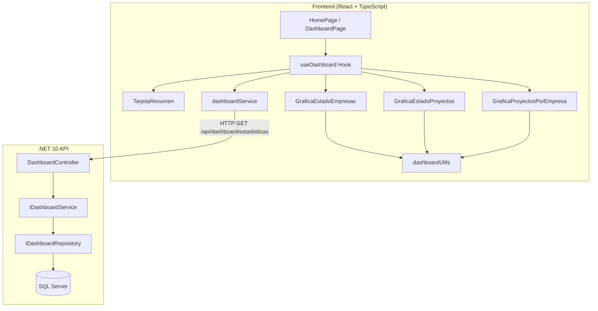
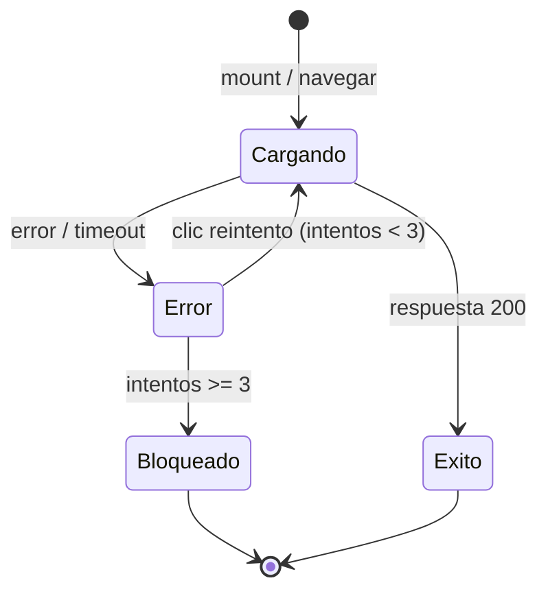

# Design Document: Dashboard de Estadísticas

## Overview

El Dashboard de Estadísticas es la página principal del sistema que muestra información consolidada de empresas y proyectos mediante tarjetas de resumen y gráficas interactivas. La arquitectura sigue el patrón existente del proyecto: un endpoint API en el backend .NET que agrega datos estadísticos en una sola respuesta, y un frontend React que consume este endpoint para renderizar los componentes visuales.

### Decisiones de diseño clave

1. **Endpoint único consolidado**: Un solo endpoint `GET /api/dashboard/estadisticas` devuelve todos los datos necesarios para evitar múltiples llamadas desde el frontend.
2. **Agregación en el backend**: Los conteos y agrupaciones se calculan mediante consultas SQL optimizadas a través de Entity Framework Core, evitando cargar todas las entidades en memoria.
3. **Librería de gráficas**: Se usará [Recharts](https://recharts.org/) para las gráficas, ya que es una librería React nativa basada en SVG, mantenida activamente y compatible con React 19.
4. **Separación de lógica de presentación**: Las funciones de transformación de datos (porcentajes, truncamiento, ordenamiento, top-N) se implementan como funciones puras separadas para facilitar el testing.

## Architecture



### Capas del Backend

| Capa | Responsabilidad |
|------|----------------|
| `CompanyProjectManagement.Api` | Controller, ruta HTTP, serialización JSON |
| `CompanyProjectManagement.Application` | Servicio de aplicación, DTO de respuesta, lógica de orquestación |
| `CompanyProjectManagement.Domain` | Interfaz de repositorio (contrato de acceso a datos) |
| `CompanyProjectManagement.Infrastructure` | Implementación del repositorio con EF Core + consultas optimizadas |

## Components and Interfaces

### Backend

#### DashboardController

```csharp
namespace CompanyProjectManagement.Api.Controllers;

[ApiController]
[Route("api/dashboard")]
public class DashboardController : ControllerBase
{
    private readonly IDashboardService _dashboardService;

    public DashboardController(IDashboardService dashboardService)
    {
        _dashboardService = dashboardService;
    }

    [HttpGet("estadisticas")]
    public async Task<IActionResult> ObtenerEstadisticas()
    {
        var estadisticas = await _dashboardService.ObtenerEstadisticasAsync();
        return Ok(estadisticas);
    }
}
```

#### IDashboardService

```csharp
namespace CompanyProjectManagement.Application.Services;

public interface IDashboardService
{
    Task<DashboardEstadisticasResponse> ObtenerEstadisticasAsync();
}
```

#### IDashboardRepository

```csharp
namespace CompanyProjectManagement.Domain.Repositories;

public interface IDashboardRepository
{
    Task<int> ContarEmpresasAsync();
    Task<int> ContarEmpresasHabilitadasAsync();
    Task<int> ContarProyectosAsync();
    Task<int> ContarProyectosHabilitadosAsync();
    Task<IEnumerable<ProyectosPorEmpresaItem>> ObtenerProyectosPorEmpresaAsync();
}
```

#### DashboardService (Implementación)

```csharp
namespace CompanyProjectManagement.Application.Services;

public class DashboardService : IDashboardService
{
    private readonly IDashboardRepository _repository;

    public DashboardService(IDashboardRepository repository)
    {
        _repository = repository;
    }

    public async Task<DashboardEstadisticasResponse> ObtenerEstadisticasAsync()
    {
        var totalEmpresas = await _repository.ContarEmpresasAsync();
        var empresasHabilitadas = await _repository.ContarEmpresasHabilitadasAsync();
        var totalProyectos = await _repository.ContarProyectosAsync();
        var proyectosHabilitados = await _repository.ContarProyectosHabilitadosAsync();
        var proyectosPorEmpresa = await _repository.ObtenerProyectosPorEmpresaAsync();

        return new DashboardEstadisticasResponse(
            TotalEmpresas: totalEmpresas,
            EmpresasHabilitadas: empresasHabilitadas,
            EmpresasDeshabilitadas: totalEmpresas - empresasHabilitadas,
            TotalProyectos: totalProyectos,
            ProyectosHabilitados: proyectosHabilitados,
            ProyectosDeshabilitados: totalProyectos - proyectosHabilitados,
            ProyectosPorEmpresa: proyectosPorEmpresa.ToList()
        );
    }
}
```

#### DashboardRepository (Implementación con EF Core)

```csharp
namespace CompanyProjectManagement.Infrastructure.Data.Repositories;

public class DashboardRepository : IDashboardRepository
{
    private readonly ApplicationDbContext _context;

    public DashboardRepository(ApplicationDbContext context)
    {
        _context = context;
    }

    public Task<int> ContarEmpresasAsync()
        => _context.Empresas.CountAsync();

    public Task<int> ContarEmpresasHabilitadasAsync()
        => _context.Empresas.CountAsync(e => e.EstadoHabilitacion);

    public Task<int> ContarProyectosAsync()
        => _context.Proyectos.CountAsync();

    public Task<int> ContarProyectosHabilitadosAsync()
        => _context.Proyectos.CountAsync(p => p.EstadoHabilitacion);

    public async Task<IEnumerable<ProyectosPorEmpresaItem>> ObtenerProyectosPorEmpresaAsync()
    {
        return await _context.Empresas
            .Select(e => new ProyectosPorEmpresaItem(
                e.Nombre,
                e.Proyectos.Count
            ))
            .Where(x => x.CantidadProyectos > 0)
            .OrderByDescending(x => x.CantidadProyectos)
            .ToListAsync();
    }
}
```

### Frontend

#### useDashboard Hook

```typescript
// src/hooks/useDashboard.ts
interface UseDashboardResult {
  data: DashboardEstadisticas | null;
  loading: boolean;
  error: string | null;
  retry: () => void;
  retryCount: number;
  maxRetriesReached: boolean;
}

function useDashboard(): UseDashboardResult;
```

Gestiona el ciclo de vida de la llamada a la API: loading, data, error, reintentos (máximo 3).

#### dashboardService

```typescript
// src/services/dashboardService.ts
export const dashboardService = {
  obtenerEstadisticas: async (): Promise<DashboardEstadisticas> => {
    const { data } = await api.get<DashboardEstadisticas>(
      '/dashboard/estadisticas',
      { timeout: 10000 }
    );
    return data;
  },
};
```

#### dashboardUtils (Funciones puras)

```typescript
// src/utils/dashboardUtils.ts
export function calcularPorcentaje(valor: number, total: number, decimales: number): number;
export function truncarNombre(nombre: string, maxLength: number): string;
export function prepararDatosBarras(
  datos: ProyectosPorEmpresa[],
  maxItems: number
): ProyectosPorEmpresa[];
```

#### Componentes React

| Componente | Props | Responsabilidad |
|-----------|-------|-----------------|
| `DashboardPage` | — | Orquesta el hook y renderiza la estructura del dashboard |
| `TarjetaResumen` | `{ valor: number, etiqueta: string, icono?: ReactNode }` | Muestra un indicador numérico con su etiqueta |
| `GraficaEstadoEmpresas` | `{ habilitadas: number, deshabilitadas: number }` | Gráfica donut de estados de empresas |
| `GraficaEstadoProyectos` | `{ habilitados: number, deshabilitados: number }` | Gráfica donut de estados de proyectos |
| `GraficaProyectosPorEmpresa` | `{ datos: ProyectosPorEmpresa[] }` | Gráfica de barras con top 10 empresas |
| `DashboardLoading` | — | Indicador de carga centrado |
| `DashboardError` | `{ onRetry: () => void, disabled: boolean, mensaje: string }` | Mensaje de error con botón de reintento |

## Data Models

### Backend DTOs

```csharp
namespace CompanyProjectManagement.Application.DTOs.Responses;

public record DashboardEstadisticasResponse(
    int TotalEmpresas,
    int EmpresasHabilitadas,
    int EmpresasDeshabilitadas,
    int TotalProyectos,
    int ProyectosHabilitados,
    int ProyectosDeshabilitados,
    List<ProyectosPorEmpresaItem> ProyectosPorEmpresa
);

public record ProyectosPorEmpresaItem(
    string NombreEmpresa,
    int CantidadProyectos
);
```

### Frontend Types

```typescript
// src/types/dashboard.ts
export interface DashboardEstadisticas {
  totalEmpresas: number;
  empresasHabilitadas: number;
  empresasDeshabilitadas: number;
  totalProyectos: number;
  proyectosHabilitados: number;
  proyectosDeshabilitados: number;
  proyectosPorEmpresa: ProyectosPorEmpresa[];
}

export interface ProyectosPorEmpresa {
  nombreEmpresa: string;
  cantidadProyectos: number;
}
```

### Contrato JSON de la API

```json
{
  "totalEmpresas": 25,
  "empresasHabilitadas": 20,
  "empresasDeshabilitadas": 5,
  "totalProyectos": 87,
  "proyectosHabilitados": 72,
  "proyectosDeshabilitados": 15,
  "proyectosPorEmpresa": [
    { "nombreEmpresa": "Empresa ABC", "cantidadProyectos": 12 },
    { "nombreEmpresa": "Empresa XYZ", "cantidadProyectos": 8 }
  ]
}
```

## Correctness Properties

*Una propiedad es una característica o comportamiento que debe mantenerse verdadero en todas las ejecuciones válidas de un sistema, esencialmente, una declaración formal sobre lo que el sistema debe hacer. Las propiedades sirven como puente entre especificaciones legibles por humanos y garantías de corrección verificables por máquina.*

### Property 1: Invariante de conteo de entidades

*Para cualquier* colección de entidades (empresas o proyectos) con un campo booleano de estado de habilitación, el total reportado SHALL ser igual a la suma de las entidades habilitadas más las deshabilitadas.

**Validates: Requirements 1.1, 1.2**

### Property 2: Integridad de agrupación de proyectos por empresa

*Para cualquier* conjunto de empresas con proyectos asociados, la suma de `cantidadProyectos` de todos los items de la agrupación SHALL ser igual al total de proyectos en el sistema, y cada item SHALL tener un `nombreEmpresa` no vacío y un `cantidadProyectos` mayor a cero.

**Validates: Requirements 1.3**

### Property 3: Corrección del cálculo de porcentajes

*Para cualquier* par de valores enteros no negativos (habilitados, deshabilitados) donde la suma sea mayor a cero, el porcentaje calculado de cada segmento SHALL sumar aproximadamente 100% (con tolerancia de ±0.1 por redondeo), y cada porcentaje individual SHALL estar en el rango [0, 100].

**Validates: Requirements 3.2, 4.2**

### Property 4: Preparación de datos de gráfica de barras (top-N + orden descendente)

*Para cualquier* lista de pares (nombreEmpresa, cantidadProyectos) con más de 10 elementos, la función de preparación SHALL retornar exactamente 10 elementos, ordenados de forma descendente por cantidadProyectos, y estos SHALL ser los 10 con mayor cantidad de la lista original.

**Validates: Requirements 5.1, 5.4**

### Property 5: Truncamiento de nombres

*Para cualquier* cadena de texto, si su longitud excede 20 caracteres, el resultado truncado SHALL tener exactamente 23 caracteres (20 + "...") y sus primeros 20 caracteres SHALL coincidir con los primeros 20 de la cadena original. Si la longitud es menor o igual a 20, el resultado SHALL ser idéntico a la cadena original.

**Validates: Requirements 5.2**

### Property 6: Renderizado de TarjetaResumen

*Para cualquier* número entero no negativo y cualquier etiqueta no vacía, el componente TarjetaResumen SHALL renderizar el valor numérico como texto y la etiqueta descriptiva como texto visible en el DOM.

**Validates: Requirements 2.5, 2.7**

## Error Handling

### Backend

| Escenario | Código HTTP | Respuesta |
|-----------|-------------|-----------|
| Éxito | 200 | `DashboardEstadisticasResponse` |
| Error de base de datos | 500 | `ErrorResponse` con mensaje genérico |
| Excepción no controlada | 500 | Manejada por `GlobalExceptionMiddleware` |

El manejo de errores sigue el patrón existente del proyecto: el `GlobalExceptionMiddleware` captura excepciones no controladas y devuelve un `ErrorResponse` con código 500. No se requiere manejo especial adicional en el controller del dashboard.

### Frontend

| Escenario | Comportamiento |
|-----------|---------------|
| Cargando | Mostrar `DashboardLoading` (spinner centrado) |
| Error de red / timeout (10s) | Mostrar `DashboardError` con botón de reintento |
| Error tras clic en reintento | Incrementar contador, re-mostrar error |
| 3 reintentos fallidos consecutivos | Deshabilitar botón, mostrar mensaje "intente más tarde" |
| Datos vacíos (totales en 0) | Mostrar valores "0" en tarjetas, gráficas en estado vacío |

### Flujo de reintentos



## Testing Strategy

### Enfoque dual de testing

El proyecto usa **Vitest** como test runner y **fast-check** (ya instalado) para property-based testing en el frontend. En el backend se usará **xUnit** con **NSubstitute** para mocks.

### Tests unitarios (example-based)

**Backend:**
- `DashboardController` devuelve 200 con datos del servicio
- `DashboardService` calcula deshabilitados como total - habilitados
- Manejo de excepción del repositorio → respuesta 500
- Caso vacío: sin datos → todos los totales en 0

**Frontend:**
- `DashboardPage` renderiza 4 tarjetas de resumen con datos del API
- Gráficas muestran exactamente 2 segmentos
- Estado de carga muestra spinner
- Estado de error muestra mensaje y botón de reintento
- Tras 3 reintentos el botón se deshabilita
- Tooltip en hover muestra valores absolutos
- Layout responsivo: 2 columnas ≥ 1024px, 1 columna < 1024px

### Tests de propiedades (property-based)

Cada propiedad del diseño se implementa como un test con **fast-check** (mínimo 100 iteraciones).

| Propiedad | Función bajo test | Generador |
|-----------|-------------------|-----------|
| Property 1 | `DashboardService.ObtenerEstadisticasAsync` | Colecciones random de entidades con `EstadoHabilitacion` aleatorio |
| Property 2 | `DashboardService.ObtenerEstadisticasAsync` | Empresas con listas random de proyectos |
| Property 3 | `calcularPorcentaje` | Pares de enteros no negativos con suma > 0 |
| Property 4 | `prepararDatosBarras` | Listas random de >10 pares (nombre, conteo) |
| Property 5 | `truncarNombre` | Cadenas random de longitud variable |
| Property 6 | `TarjetaResumen` component render | Enteros no negativos + strings no vacíos |

**Configuración de property tests:**
- Mínimo 100 iteraciones por propiedad
- Cada test referencia su propiedad del diseño con el formato:
  `// Feature: dashboard-estadisticas, Property {N}: {título}`

### Tests de integración

- Performance test: endpoint responde en < 500ms con 1000 empresas y 5000 proyectos (seeded DB)
- End-to-end: verificar que el frontend carga y muestra datos reales del backend
