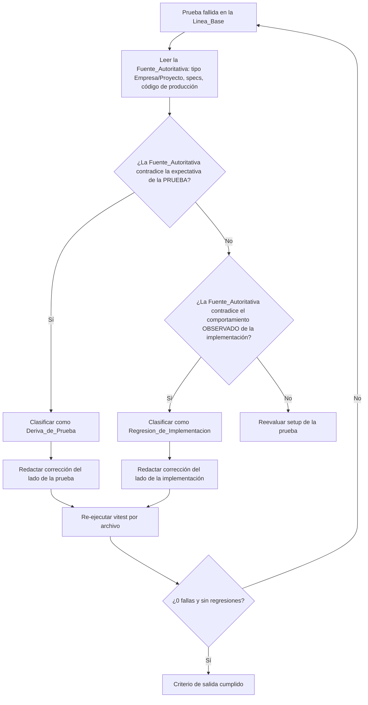

# Design Document

## Overview

Este documento de diseño describe la reparación de la suite de pruebas del frontend, que actualmente reporta 19 pruebas fallidas en 4 archivos al ejecutar `npx vitest run`. No se trata de una funcionalidad nueva de producto, sino de una investigación de diagnóstico y reparación (test-repair).

El propósito es restaurar la suite a estado verde (0 fallas) corrigiendo pruebas que quedaron desactualizadas respecto al comportamiento previsto vigente. Tras leer las fuentes reales de producción (`frontend/src/types/empresa.ts`, `frontend/src/hooks/useEmpresaForm.ts`, `frontend/src/utils/validarEmpresaForm.ts`, `frontend/src/components/EmpresaFormModal.tsx`, `frontend/src/pages/ProyectosPage.tsx`) y compararlas contra las pruebas, se determinó que **las 19 fallas son Deriva_de_Prueba** (las expectativas de las pruebas quedaron obsoletas), no Regresion_de_Implementacion. Por tanto, todas las correcciones son del lado de las pruebas.

**Alcance**

- 4 archivos de prueba, 19 pruebas:
  - `frontend/src/hooks/__tests__/useEmpresaForm.test.ts` (10 fallas — Clúster A y una del Clúster B).
  - `frontend/src/pages/__tests__/EmpresasPage.integration.test.tsx` (5 fallas — Clúster A).
  - `frontend/src/components/__tests__/EmpresaFormModal.test.tsx` (3 fallas — Clúster B).
  - `frontend/src/pages/__tests__/ProyectosPage.test.tsx` (1 falla — Clúster C).

**No-objetivos (fuera de alcance)**

- No se modifica ningún comportamiento observable de producto. El código de producción se considera correcto según la Fuente_Autoritativa.
- El bugfix `collapsed-menu-icon-centering` (cambio exclusivamente de CSS) queda explícitamente fuera de alcance.
- No se agregan funcionalidades nuevas ni se refactoriza la implementación.

## Architecture

### Flujo de triage por prueba

La investigación sigue un flujo de decisión repetible por cada prueba fallida:



### Insight compartido: una sola causa raíz aguas arriba

El hallazgo central de la arquitectura de fallas es que **la mayoría de las fallas de los Clústeres A y B comparten UNA misma causa aguas arriba**: las pruebas fueron escritas cuando el formulario de Empresa gestionaba solo `nombre`, `direccion` y `telefono`. La evolución de la funcionalidad (spec `add-empresa-ui-form` + tipo `Empresa`) agregó dos campos: `identificacion` (obligatorio) y `estadoHabilitacion` (con valor por defecto `true`).

`validarCampos` (`frontend/src/utils/validarEmpresaForm.ts`) ahora valida `identificacion` como campo obligatorio. Como las pruebas afectadas nunca establecen un valor para `identificacion`, la validación falla y `handleSubmit` retorna temprano (short-circuit) **antes** de invocar al Servicio_Empresa y **antes** de poner `submitting = true`. Esto produce, en cadena, síntomas aparentemente distintos:

- El servicio "nunca fue llamado" (`Number of calls: 0`).
- Los errores de servidor mapeados "quedan undefined" (nunca se llega al `catch`).
- El botón "Guardando..." "no se encuentra" (`submitting` nunca se vuelve `true`).

Reconocer esta causa única evita tratar cada síntoma como un defecto de implementación independiente. La corrección estructural es: **hacer que las pruebas provean un `identificacion` válido** para que el flujo de envío avance como está previsto.

El Clúster C es independiente: su causa es que la prueba espía `window.confirm` mientras la Pagina_Proyectos usa el componente `ConfirmDialog`.

## Components and Interfaces

Esta sección documenta el contrato autoritativo vigente que las pruebas deben reflejar. Todo lo aquí descrito ya está implementado y verificado en las fuentes; no requiere cambios.

### Conjunto_de_Campos_Empresa (autoritativo)

Según `frontend/src/types/empresa.ts` y `frontend/src/utils/validarEmpresaForm.ts`, el formulario gestiona **5 campos de datos**:

| Campo | Tipo | Obligatorio | Valor por defecto (crear) |
|---|---|---|---|
| `nombre` | string | Sí | `''` |
| `identificacion` | string | Sí | `''` |
| `direccion` | string | Sí | `''` |
| `telefono` | string | Sí | `''` |
| `estadoHabilitacion` | boolean | No (opcional en crear) | `true` |

El `EmpresaFormData` inicial en modo crear es:

```ts
{ nombre: '', identificacion: '', direccion: '', telefono: '', estadoHabilitacion: true }
```

En modo editar, `getInitialFormData` copia los 5 campos desde `empresaInicial`.

### Firma de llamadas al Servicio_Empresa

`useEmpresaForm.handleSubmit` construye `requestData` con los 5 campos y llama al servicio incluyendo la opción de timeout:

```ts
const requestData = {
  nombre, identificacion, telefono, direccion, estadoHabilitacion,
};

// modo crear
await empresaService.crear(requestData, { timeout: 30000 });

// modo editar
await empresaService.actualizar(empresaInicial.id, requestData, { timeout: 30000 });
```

**Decisión de diseño:** el argumento `{ timeout: 30000 }` forma parte del contrato previsto (no debe eliminarse), porque está presente en la implementación vigente y las pruebas ya lo afirman correctamente. Solo el conjunto de campos del primer argumento quedó desactualizado en las pruebas.

### Contrato del Estado_Submitting y del Modal_Empresa

De `frontend/src/components/EmpresaFormModal.tsx` y `frontend/src/hooks/useEmpresaForm.ts`:

- El botón de envío renderiza `{submitting ? 'Guardando...' : 'Guardar'}` y tiene `disabled={submitting}`.
- El nombre accesible del botón es "Guardar" en reposo y "Guardando..." mientras hay un envío en curso.
- Durante el envío, el Modal_Empresa NO se cierra por Escape ni por clic en el overlay (ambos handlers verifican `!submitting`).
- Ciclo de vida de `submitting`: se pone en `true` justo antes de la llamada al servicio y vuelve a `false` en el bloque `finally` (tanto en resolución como en rechazo de la promesa).

**Importante:** el botón "Guardando..." SÍ existe en el componente. Solo es observable mientras `submitting === true`, lo que requiere que (a) la validación pase (con `identificacion` válido) y (b) la promesa del servicio permanezca pendiente durante la aserción.

### Flujo de confirmación de eliminación (Dialogo_Confirmacion)

De `frontend/src/pages/ProyectosPage.tsx`:

- La eliminación NO usa `window.confirm`. Usa el componente `ConfirmDialog`.
- `solicitarEliminar(proyectoId)` abre el diálogo (`confirmState`).
- Al confirmar, `confirmarEliminar` llama `proyectoService.eliminar(id, proyectoId)`, filtra la fila del estado y muestra la notificación "Proyecto eliminado exitosamente".
- El `ConfirmDialog` renderiza `title="Eliminar Proyecto"`, `message="¿Estás seguro de que deseas eliminar este proyecto? Esta acción no se puede deshacer."`, `confirmLabel="Eliminar"`, `cancelLabel="Cancelar"`.
- **Colisión de nombres accesibles:** tanto el botón de acción de la fila como el botón de confirmación del diálogo tienen el nombre "Eliminar". Las consultas de la prueba deben acotarse (por ejemplo con `within(dialog)`) para evitar ambigüedad.

## Data Models

Los modelos de datos relevantes ya están definidos y son la Fuente_Autoritativa; no se modifican.

### Empresa (`frontend/src/types/empresa.ts`)

```ts
interface Empresa {
  id: number;
  nombre: string;
  identificacion: string;
  direccion: string;
  telefono: string;
  estadoHabilitacion: boolean;
  createdAt: string;
  updatedAt: string | null;
}
```

`CrearEmpresaRequest` incluye los 5 campos de datos (`estadoHabilitacion` opcional); `ActualizarEmpresaRequest` incluye los 5 campos de datos.

### EmpresaFormData / EmpresaFormErrors (`frontend/src/utils/validarEmpresaForm.ts`)

```ts
interface EmpresaFormData {
  nombre: string; identificacion: string; direccion: string; telefono: string; estadoHabilitacion: boolean;
}
interface EmpresaFormErrors {
  nombre?: string; identificacion?: string; direccion?: string; telefono?: string;
}
```

`validarCampos` valida `nombre`, `identificacion`, `direccion` y `telefono`. `identificacion` es obligatorio (mínimo 2, máximo 50 caracteres). Este es el punto exacto donde el envío se corta si la prueba no aporta `identificacion`.

### Proyecto (`frontend/src/types/proyecto.ts`)

`ProyectoListResponse` = `{ id, nombre, fechaHabilitacion, estadoHabilitacion }`. El método relevante es `proyectoService.eliminar(empresaId, proyectoId)`.

## Análisis de causa raíz por clúster y tablas de corrección

Todas las clasificaciones son **Deriva_de_Prueba**. La justificación general (Requirement 2.5, 7.3): la Fuente_Autoritativa (tipo `Empresa` de 5 campos + spec `add-empresa-ui-form` + implementación vigente) contradice las expectativas de las pruebas, por lo que se actualizan las pruebas, no la implementación.

### Clúster A — Deriva de la forma del formulario de Empresa (15 fallas)

Causa raíz: las pruebas asumen un formulario de 3 campos y omiten `identificacion` (obligatorio) y `estadoHabilitacion`.

**Archivo: `useEmpresaForm.test.ts` (10 fallas)**

| Prueba | Falla observada | Clasificación | Corrección exacta |
|---|---|---|---|
| initialize with empty fields in create mode | `formData` esperado `{nombre,direccion,telefono}`; recibido incluye `identificacion:''` y `estadoHabilitacion:true` | Deriva_de_Prueba | Actualizar el objeto esperado a los 5 campos: `{nombre:'',identificacion:'',direccion:'',telefono:'',estadoHabilitacion:true}` |
| initialize with empresaInicial data in edit mode | `formData` esperado omite `identificacion` y `estadoHabilitacion` | Deriva_de_Prueba | Añadir `identificacion` y `estadoHabilitacion` de `empresaInicial` al objeto esperado |
| call crear with correct data and callbacks | `crear` esperado con 3 campos; además nunca se llama (`Number of calls: 0`) porque falta `identificacion` | Deriva_de_Prueba | Establecer `handleChange('identificacion', ...)` con valor válido; esperar payload de 5 campos (con `estadoHabilitacion:true` por defecto) y `{timeout:30000}` |
| call actualizar with id and correct data | `actualizar` esperado con payload de 3 campos | Deriva_de_Prueba | Esperar payload de 5 campos + `empresaInicial.id` + `{timeout:30000}` (los campos no modificados provienen de `empresaInicial`) |
| map server validation errors (400) | `errores.nombre/telefono` recibidos `undefined` (short-circuit por falta de `identificacion`) | Deriva_de_Prueba | Establecer `identificacion` válido para que el envío llegue al `catch` |
| set errorServidor for conflict (409) | `errorServidor` no seteado (short-circuit) | Deriva_de_Prueba | Establecer `identificacion` válido |
| set errorServidor for server error (500) | `errorServidor` no seteado (short-circuit) | Deriva_de_Prueba | Establecer `identificacion` válido |
| set errorServidor for timeout (ECONNABORTED) | `errorServidor` no seteado (short-circuit) | Deriva_de_Prueba | Establecer `identificacion` válido |
| clears errorServidor when any field changes | `errorServidor` nunca se estableció (short-circuit) antes de limpiarse | Deriva_de_Prueba | Establecer `identificacion` válido para llegar al error de servidor y luego verificar la limpieza |
| should NOT call service if validation fails | Prueba de validación negativa (puede pasar hoy, se documenta por completitud) | Deriva_de_Prueba (verificar) | Mantener intención; confirmar que con campos vacíos `errores.identificacion` también queda definido |

Nota sobre `validForm` de prueba: el objeto `validFormData` del archivo YA incluye `identificacion: 'NIT-789012'`, pero las pruebas fallidas construyen el formulario con `handleChange` de solo 3 campos en lugar de usar `validFormData` completo. La corrección es añadir la llamada `handleChange('identificacion', validFormData.identificacion)`.

**Archivo: `EmpresasPage.integration.test.tsx` (5 fallas)**

| Prueba | Falla observada | Clasificación | Corrección exacta |
|---|---|---|---|
| create a new empresa (full creation flow) | `crear` esperado con `{nombre,direccion,telefono}` y el envío no procede (falta `identificacion`) | Deriva_de_Prueba | Rellenar el input "Identificación" en el modal; esperar payload de 5 campos + `{timeout:30000}` |
| edit an existing empresa (full edit flow) | `actualizar` esperado con payload de 3 campos | Deriva_de_Prueba | Esperar payload de 5 campos (los pre-cargados desde la fila) + `{timeout:30000}` |
| keep modal open with error 500 | El envío no procede por falta de `identificacion` | Deriva_de_Prueba | Rellenar "Identificación" para llegar al error de servidor |
| call crear for new empresa | `crear` no llamado (short-circuit) | Deriva_de_Prueba | Rellenar "Identificación" antes de enviar |
| call actualizar with correct id for edit | `actualizar` esperado con payload de 3 campos | Deriva_de_Prueba | Esperar payload de 5 campos + id + `{timeout:30000}` |

### Clúster B — "Guardando..." no encontrado (3 fallas en el modal + 1 relacionada en el hook)

Causa raíz: `submitting` nunca se vuelve `true` porque el envío se corta en la validación al faltar `identificacion`. El botón "Guardando..." existe en el componente, pero no llega a renderizarse.

**Archivo: `EmpresaFormModal.test.tsx` (3 fallas)**

| Prueba | Falla observada | Clasificación | Corrección exacta |
|---|---|---|---|
| does NOT close on Escape during submit | `Unable to find role=button name "Guardando..."` | Deriva_de_Prueba | Rellenar el input "Identificación" con valor válido (el mock ya devuelve una promesa pendiente `new Promise(() => {})`) para que `submitting` se vuelva `true` |
| does NOT close on overlay click during submit | `Unable to find role=button name "Guardando..."` | Deriva_de_Prueba | Rellenar "Identificación" válido; el mock ya mantiene la promesa pendiente |
| Save button shows "Guardando..." and disabled during submit | `Unable to find role=button name "Guardando..."` | Deriva_de_Prueba | Rellenar "Identificación" válido; confirmar contra el código que la etiqueta y `disabled` son correctos (NO cambiar el componente) |

Estas pruebas ya mantienen la promesa del servicio pendiente con `new Promise(() => {})`; el único ajuste necesario es proveer `identificacion` válido para que la validación pase. No se debe modificar el Modal_Empresa.

**Archivo: `useEmpresaForm.test.ts` (1 falla del Clúster B, contada aparte)**

| Prueba | Falla observada | Clasificación | Corrección exacta |
|---|---|---|---|
| should set submitting to true during async operation and false after | `submitting` recibido `false` (nunca fue `true` por short-circuit) | Deriva_de_Prueba | Establecer `handleChange('identificacion', ...)` válido para que el envío avance; el mock ya usa una promesa controlada por `resolvePromise` |

**Aclaración explícita (Requirement 4.5):** esta prueba NO refleja un defecto real del ciclo de vida del Estado_Submitting. El ciclo `true → finally → false` está correctamente implementado. La falla es un síntoma de la misma deriva de campos del Clúster A (falta de `identificacion`). Se documenta aquí por su asociación con el estado de envío, pero su raíz es la deriva de la forma del formulario.

### Clúster C — Confirmación de eliminación de Proyecto (1 falla)

Causa raíz: la prueba espía `window.confirm`, pero la Pagina_Proyectos usa el componente `ConfirmDialog`.

**Archivo: `ProyectosPage.test.tsx` (1 falla)**

| Prueba | Falla observada | Clasificación | Corrección exacta |
|---|---|---|---|
| should delete a proyecto: click "Eliminar" → confirm → row removed + success notification | `confirmSpy` afirmado con `'¿Estás seguro de eliminar este proyecto?'`, pero `window.confirm` nunca se invoca | Deriva_de_Prueba | Eliminar el espía/aserción de `window.confirm`. Tras clic en "Eliminar" de la fila, localizar el `ConfirmDialog` (`role=dialog`), hacer clic en su botón de confirmación "Eliminar" acotado con `within(dialog)`, y luego afirmar `proyectoService.eliminar(1,1)`, remoción de la fila y notificación "Proyecto eliminado exitosamente" |

**Colisión de nombres:** el botón de acción de la fila y el botón del diálogo comparten el nombre "Eliminar". La prueba debe acotar las consultas (por ejemplo, `within(dialog).getByRole('button', { name: 'Eliminar' })`) para desambiguar.

## Correctness Properties

No aplica pruebas basadas en propiedades (PBT) a esta especificación.

Esta es una investigación de reparación de pruebas cuyo trabajo consiste en actualizar expectativas de pruebas existentes para alinearlas con contratos de UI y servicio ya implementados. No hay funciones puras nuevas con propiedades universales que verificar; la lógica de validación (`validarCampos`) y los flujos de UI ya están cubiertos por pruebas de ejemplo e integración. Conforme a la guía del formato (UI rendering, operaciones con efectos secundarios y flujos con dependencias externas no son adecuados para PBT), se omite la sección de propiedades y se especifican únicamente pruebas de ejemplo e integración en la estrategia de pruebas.

## Error Handling

El manejo de errores del Hook_Empresa ya está implementado y es correcto; las pruebas de error del Clúster A solo necesitan entrada válida (`identificacion`) para que el flujo llegue al bloque `catch`. Comportamiento esperado mapeado:

| Condición | Comportamiento esperado (implementado) |
|---|---|
| HTTP 400 con `data.errors` | Mapear a `errores.{nombre,identificacion,direccion,telefono}` según las claves presentes |
| HTTP 409 | `errorServidor = 'Ya existe una empresa con ese nombre.'` |
| HTTP 500 | `errorServidor = 'Ocurrió un error en el servidor. Intente nuevamente.'` |
| Timeout (`code === 'ECONNABORTED'`) | `errorServidor = 'La solicitud excedió el tiempo de espera.'` |
| Finalización (éxito o error) | `submitting` vuelve a `false` en el `finally` |

En todos los casos de error, la validación previa debe pasar; por eso las pruebas de error requieren un `identificacion` válido antes de simular la respuesta del servidor. En el flujo de eliminación de Proyecto, si `proyectoService.eliminar` rechaza, la Pagina_Proyectos muestra "Error al eliminar el proyecto"; la prueba del Clúster C cubre solo la ruta de éxito.

## Testing Strategy

**Enfoque:** solo pruebas de ejemplo e integración (sin PBT). Cada corrección preserva la intención de verificación original de la prueba (Requirement 6.3) y solo ajusta expectativas identificadas como Deriva_de_Prueba (Requirement 7.3).

**Procedimiento de verificación:**

1. Aplicar las correcciones por archivo y re-ejecutar de forma aislada:
   - `npx vitest run frontend/src/hooks/__tests__/useEmpresaForm.test.ts`
   - `npx vitest run frontend/src/pages/__tests__/EmpresasPage.integration.test.tsx`
   - `npx vitest run frontend/src/components/__tests__/EmpresaFormModal.test.tsx`
   - `npx vitest run frontend/src/pages/__tests__/ProyectosPage.test.tsx`
2. Ejecutar la suite completa: `npx vitest run`.
3. **Criterio de salida:** 0 pruebas fallidas (Requirement 6.1).

**Restricciones de calidad:**

- No eliminar ni deshabilitar pruebas no relacionadas para forzar el verde (Requirement 6.2).
- No debilitar aserciones más allá de lo necesario para reflejar el contrato vigente.
- Confirmar que ninguna prueba previamente en verde regrese (Requirement 6.4). Especial atención a la colisión de nombres "Eliminar" en `ProyectosPage.test.tsx`, que podría romper otras consultas si no se acota con `within`.
- No modificar código de producción (Requirement 7.1, 7.3): todas las clasificaciones son Deriva_de_Prueba.
- Usar el flag `--run` (implícito en `vitest run`) para ejecución única, no modo watch.

## Requirements Traceability

| Sección de diseño | Requisitos cubiertos |
|---|---|
| Overview (alcance, 19 fallas / 4 archivos, no-objetivos) | Requirement 1.1, 1.2, 1.5; Requirement 7.4 |
| Architecture — flujo de triage y clasificación | Requirement 2.1, 2.2 |
| Architecture — insight de causa compartida | Requirement 1.3, 1.4; Requirement 4.4 |
| Components — Conjunto_de_Campos_Empresa y firma del servicio | Requirement 3.1, 3.2, 3.3, 3.5, 3.6 |
| Components — contrato Estado_Submitting / Modal_Empresa | Requirement 4.1, 4.2, 4.3 |
| Components — flujo de confirmación (ConfirmDialog) | Requirement 5.1, 5.2 |
| Data Models — Empresa, EmpresaFormData, Proyecto | Requirement 2.3, 2.4; Requirement 3.2 |
| Tablas de corrección Clúster A | Requirement 3.4, 3.5, 3.6; Requirement 2.5 |
| Tablas de corrección Clúster B | Requirement 4.4, 4.5, 4.6 |
| Tablas de corrección Clúster C | Requirement 5.3, 5.4, 5.5 |
| Error Handling | Requirement 4.3; Requirement 5.4 |
| Testing Strategy | Requirement 6.1, 6.2, 6.3, 6.4; Requirement 7.1, 7.2, 7.3 |
