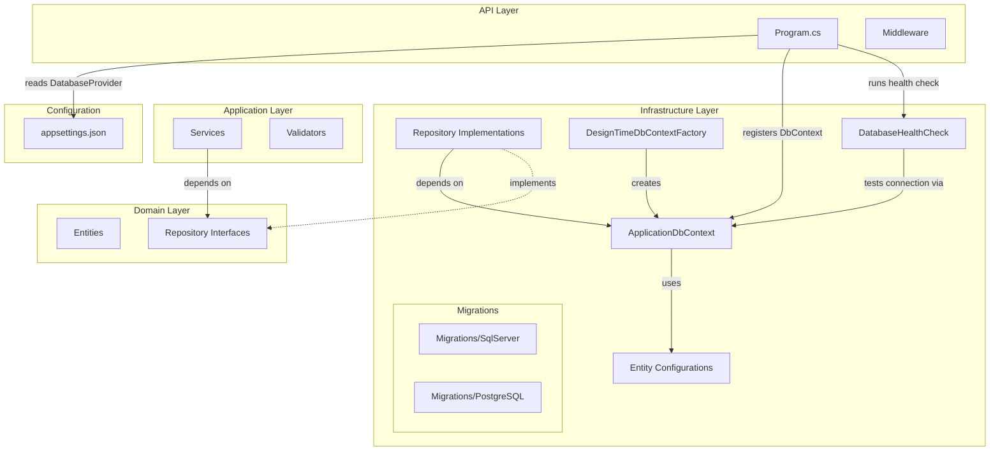
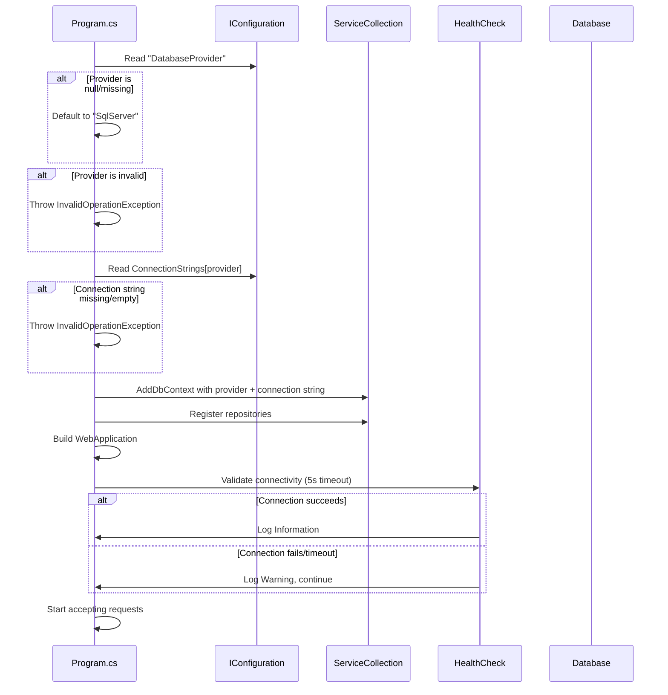

# Design Document: PostgreSQL Support

## Overview

Este diseño describe cómo agregar soporte de PostgreSQL como proveedor alternativo de base de datos al proyecto CompanyProjectManagement, manteniendo la compatibilidad con SQL Server. La solución se basa en la capacidad nativa de Entity Framework Core para abstraer proveedores de base de datos, permitiendo intercambiar el motor mediante configuración sin modificar las capas Domain ni Application.

### Decisiones clave de diseño

1. **Selección por configuración**: El proveedor se elige mediante una clave `DatabaseProvider` en `appsettings.json`, sin requerir cambios en código.
2. **Repositorios compartidos**: Los repositorios existentes ya usan APIs agnósticas de EF Core (LINQ, DbSet), por lo que no requieren modificación.
3. **Migraciones separadas**: Cada proveedor mantiene su propio directorio de migraciones para evolución independiente del esquema.
4. **Validación temprana**: Un health check al inicio detecta problemas de conectividad sin bloquear el arranque de la aplicación.
5. **Fail-fast en configuración inválida**: Si el proveedor no es reconocido o falta la cadena de conexión, la aplicación lanza una excepción inmediata durante el inicio.

## Architecture

### Diagrama de componentes



### Flujo de inicialización



## Components and Interfaces

### 1. Extensión de registro de servicios de base de datos

**Archivo**: `Infrastructure/Extensions/DatabaseServiceExtensions.cs`

Método de extensión estático que encapsula la lógica de selección de proveedor y registro del `ApplicationDbContext` en el contenedor DI.

```csharp
public static class DatabaseServiceExtensions
{
    private static readonly string[] SupportedProviders = ["SqlServer", "PostgreSQL"];

    public static IServiceCollection AddDatabaseProvider(
        this IServiceCollection services,
        IConfiguration configuration)
    {
        var provider = configuration["DatabaseProvider"] ?? "SqlServer";

        if (!SupportedProviders.Contains(provider))
            throw new InvalidOperationException(
                $"Unsupported database provider: '{provider}'. Valid providers: {string.Join(", ", SupportedProviders)}");

        var connectionString = configuration.GetConnectionString(provider);

        if (string.IsNullOrWhiteSpace(connectionString))
            throw new InvalidOperationException(
                $"Connection string '{provider}' is missing or empty for the configured database provider '{provider}'.");

        services.AddDbContext<ApplicationDbContext>(options =>
        {
            switch (provider)
            {
                case "PostgreSQL":
                    options.UseNpgsql(connectionString, npgsql =>
                        npgsql.MigrationsAssembly(typeof(ApplicationDbContext).Assembly.FullName));
                    break;
                case "SqlServer":
                    options.UseSqlServer(connectionString, sql =>
                        sql.MigrationsAssembly(typeof(ApplicationDbContext).Assembly.FullName));
                    break;
            }
        });

        return services;
    }
}
```

### 2. DesignTimeDbContextFactory actualizada

**Archivo**: `Infrastructure/Data/DesignTimeDbContextFactory.cs`

Acepta un argumento `--provider` para determinar qué proveedor usar al generar migraciones. Por defecto usa SqlServer.

```csharp
public class DesignTimeDbContextFactory : IDesignTimeDbContextFactory<ApplicationDbContext>
{
    private static readonly string[] ValidProviders = ["SqlServer", "PostgreSQL"];

    public ApplicationDbContext CreateDbContext(string[] args)
    {
        var provider = ResolveProvider(args);
        var optionsBuilder = new DbContextOptionsBuilder<ApplicationDbContext>();

        switch (provider)
        {
            case "PostgreSQL":
                optionsBuilder.UseNpgsql("Host=localhost;Database=CompanyProjectManagement;Username=postgres;Password=postgres",
                    npgsql => npgsql.MigrationsAssembly(typeof(ApplicationDbContext).Assembly.FullName));
                break;
            default: // SqlServer
                optionsBuilder.UseSqlServer("Server=localhost,1433;Database=CompanyProjectManagement;User Id=sa;Password=Qazw5xedc;TrustServerCertificate=True;",
                    sql => sql.MigrationsAssembly(typeof(ApplicationDbContext).Assembly.FullName));
                break;
        }

        return new ApplicationDbContext(optionsBuilder.Options);
    }

    private static string ResolveProvider(string[] args)
    {
        var providerArg = args.FirstOrDefault(a => a.StartsWith("--provider="));
        if (providerArg is null) return "SqlServer";

        var value = providerArg.Split('=', 2)[1];
        return ValidProviders.Contains(value) ? value : "SqlServer";
    }
}
```

### 3. Database Health Check

**Archivo**: `Infrastructure/HealthChecks/DatabaseHealthCheck.cs`

Servicio que ejecuta una conexión de prueba durante el inicio de la aplicación.

```csharp
public static class DatabaseHealthCheck
{
    public static async Task ValidateConnectivityAsync(
        IServiceProvider services,
        IConfiguration configuration,
        ILogger logger)
    {
        var provider = configuration["DatabaseProvider"] ?? "SqlServer";

        using var scope = services.CreateScope();
        var context = scope.ServiceProvider.GetRequiredService<ApplicationDbContext>();

        using var cts = new CancellationTokenSource(TimeSpan.FromSeconds(5));

        try
        {
            var canConnect = await context.Database.CanConnectAsync(cts.Token);
            if (canConnect)
            {
                logger.LogInformation("Database connectivity validated. Provider: {Provider}", provider);
            }
            else
            {
                logger.LogWarning("Database connectivity check failed. Provider: {Provider}", provider);
            }
        }
        catch (Exception ex) when (ex is OperationCanceledException or TaskCanceledException)
        {
            logger.LogWarning("Database connectivity check timed out after 5 seconds. Provider: {Provider}", provider);
        }
        catch (Exception ex)
        {
            logger.LogWarning(ex, "Database connectivity check failed. Provider: {Provider}, Error: {Error}", provider, ex.Message);
        }
    }
}
```

### 4. Cambios en Program.cs

```csharp
// Replace current DbContext registration with:
builder.Services.AddDatabaseProvider(builder.Configuration);

// After app.Build(), before app.Run():
await DatabaseHealthCheck.ValidateConnectivityAsync(
    app.Services, app.Configuration, app.Logger);
```

### 5. Configuración actualizada de appsettings.json

```json
{
  "DatabaseProvider": "SqlServer",
  "ConnectionStrings": {
    "SqlServer": "Server=localhost,1433;Database=CompanyProjectManagement;User Id=sa;Password=...;TrustServerCertificate=True;",
    "PostgreSQL": "Host=localhost;Port=5432;Database=CompanyProjectManagement;Username=postgres;Password=..."
  }
}
```

## Data Models

No se introducen cambios en las entidades de dominio (`Empresa`, `Proyecto`). Las configuraciones de EF Core existentes (`EmpresaConfiguration`, `ProyectoConfiguration`) utilizan exclusivamente APIs agnósticas de proveedor:

- `HasKey`, `Property`, `IsRequired`, `HasMaxLength` → traducidos idénticamente por ambos proveedores
- `HasIndex().IsUnique()` → genera `CREATE UNIQUE INDEX` en ambos
- `HasDefaultValue(true)` → genera `DEFAULT` constraint equivalente
- `HasMany/WithOne/HasForeignKey/OnDelete(Restrict)` → genera FK con `ON DELETE RESTRICT` / `NO ACTION`

**Mapeo de tipos entre proveedores:**

| Propiedad | C# Type | SQL Server | PostgreSQL |
|-----------|---------|------------|------------|
| Id | `int` | `int` | `integer` |
| Nombre | `string` (MaxLength 200) | `nvarchar(200)` | `character varying(200)` |
| Identificacion | `string` (MaxLength 50) | `nvarchar(50)` | `character varying(50)` |
| Telefono | `string` (MaxLength 20) | `nvarchar(20)` | `character varying(20)` |
| Direccion | `string` (MaxLength 300) | `nvarchar(300)` | `character varying(300)` |
| EstadoHabilitacion | `bool` | `bit` | `boolean` |
| FechaHabilitacion | `DateOnly` | `date` | `date` |
| EmpresaId (FK) | `int` | `int` | `integer` |

La única diferencia notable es `nvarchar` vs `character varying`, que son funcionalmente equivalentes para texto Unicode. EF Core maneja esta traducción automáticamente a través de cada proveedor.

### Estructura de migraciones

```
Infrastructure/
├── Migrations/
│   ├── SqlServer/
│   │   ├── 20260722194844_InitialCreate.cs
│   │   ├── 20260722194844_InitialCreate.Designer.cs
│   │   └── ApplicationDbContextModelSnapshot.cs
│   └── PostgreSQL/
│       ├── <timestamp>_InitialCreate.cs
│       ├── <timestamp>_InitialCreate.Designer.cs
│       └── ApplicationDbContextModelSnapshot.cs
```

**Generación de migraciones por proveedor:**

```bash
# SQL Server
dotnet ef migrations add <Name> --project src/CompanyProjectManagement.Infrastructure -- --provider=SqlServer

# PostgreSQL
dotnet ef migrations add <Name> --project src/CompanyProjectManagement.Infrastructure -- --provider=PostgreSQL
```

Nota: Para que las migraciones se almacenen en subdirectorios separados, se configurará `MigrationsHistoryTable` y la opción de output directory en la factory, o se usará `--output-dir` en el comando CLI.


## Correctness Properties

*A property is a characteristic or behavior that should hold true across all valid executions of a system — essentially, a formal statement about what the system should do. Properties serve as the bridge between human-readable specifications and machine-verifiable correctness guarantees.*

### Property 1: Provider selection determinism

*For any* valid provider name in `{"SqlServer", "PostgreSQL"}` and a configuration containing a non-empty connection string with that same key, the `AddDatabaseProvider` method SHALL configure the `ApplicationDbContext` with the corresponding EF Core provider (UseSqlServer or UseNpgsql) using the matching connection string value.

**Validates: Requirements 1.1, 1.2, 2.3**

### Property 2: Invalid provider rejection with descriptive message

*For any* string that is not exactly "SqlServer" or "PostgreSQL" (case-sensitive), when used as the `DatabaseProvider` configuration value, the `AddDatabaseProvider` method SHALL throw an `InvalidOperationException` whose message contains both the invalid value and the list of valid providers.

**Validates: Requirements 1.3**

### Property 3: Missing connection string rejection with descriptive message

*For any* valid provider name in `{"SqlServer", "PostgreSQL"}`, when the configuration does not contain a connection string entry with that key (or the value is null/whitespace), the `AddDatabaseProvider` method SHALL throw an `InvalidOperationException` whose message contains both the missing key name and the provider name.

**Validates: Requirements 1.4**

### Property 4: DesignTimeDbContextFactory provider argument resolution

*For any* string array of arguments, when the array contains a `--provider=X` argument where X is in `{"SqlServer", "PostgreSQL"}`, the factory SHALL create a context configured for provider X. *For any* string array that does not contain a valid `--provider=` argument (missing, empty, or invalid value), the factory SHALL default to SqlServer.

**Validates: Requirements 4.2, 4.3, 4.4**

### Property 5: Connectivity log messages contain provider name

*For any* configured provider name and any connection outcome (success, failure, or timeout), the log message emitted by the health check SHALL contain the provider name as recorded in configuration.

**Validates: Requirements 7.2, 7.4**

## Error Handling

### Errores de configuración (fail-fast en startup)

| Escenario | Momento | Acción | Excepción |
|-----------|---------|--------|-----------|
| `DatabaseProvider` con valor no soportado | Inicio (DI registration) | Throw | `InvalidOperationException` con valor inválido y lista de válidos |
| Connection string faltante/vacía | Inicio (DI registration) | Throw | `InvalidOperationException` con clave faltante y proveedor |
| Paquete NuGet no instalado | Compilación | Build error | N/A (error de compilación) |

### Errores de conectividad (resilient en startup)

| Escenario | Momento | Acción | Resultado |
|-----------|---------|--------|-----------|
| Base de datos no disponible | Post-build (health check) | Log Warning | App continúa |
| Timeout de conexión (>5s) | Post-build (health check) | Log Warning | App continúa |
| Conexión exitosa | Post-build (health check) | Log Information | App continúa |

### Errores en runtime

Los errores de base de datos durante operaciones normales (queries, saves) siguen siendo manejados por el `GlobalExceptionMiddleware` existente. No se requieren cambios en el manejo de errores de runtime porque:

1. Los repositorios lanzan excepciones de EF Core que son agnósticas al proveedor (`DbUpdateException`, `DbUpdateConcurrencyException`)
2. El middleware ya convierte estas excepciones en respuestas HTTP apropiadas

## Testing Strategy

### Testing Framework

- **Unit tests**: xUnit + FluentAssertions + NSubstitute (ya configurados en el proyecto)
- **Property tests**: FsCheck.Xunit (ya configurado, v3.3.3)
- **Integration tests**: Microsoft.AspNetCore.Mvc.Testing + InMemory provider

### Unit Tests (ejemplo-based)

| Test | Qué verifica |
|------|-------------|
| `AddDatabaseProvider_WithNullProvider_DefaultsToSqlServer` | Req 2.4 - default value |
| `HealthCheck_WhenConnectionSucceeds_LogsInformation` | Req 7.4 - success logging |
| `HealthCheck_WhenConnectionFails_ContinuesStartup` | Req 7.3 - resilience |
| `HealthCheck_WhenTimeout_LogsWarning` | Req 7.2 - timeout handling |
| `DesignTimeFactory_WithSqlServerArg_UsesSqlServer` | Req 4.4 - explicit provider |
| `DesignTimeFactory_WithPostgreSQLArg_UsesNpgsql` | Req 4.4 - explicit provider |

### Property-Based Tests (FsCheck)

Cada propiedad del documento se implementa como un test FsCheck con mínimo 100 iteraciones:

| Property | Test | Generador |
|----------|------|-----------|
| Property 1 | `ProviderSelection_AlwaysUsesMatchingConnectionString` | `Gen.Elements("SqlServer", "PostgreSQL")` |
| Property 2 | `InvalidProvider_AlwaysThrowsWithDescriptiveMessage` | `Arb.Default.String()` filtrado por `!= "SqlServer" && != "PostgreSQL"` |
| Property 3 | `MissingConnectionString_AlwaysThrowsWithProviderInfo` | `Gen.Elements("SqlServer", "PostgreSQL")` con config vacía |
| Property 4 | `DesignTimeFactory_ResolvesProviderDeterministically` | `Arb.Default.String[]` con y sin `--provider=` entries |
| Property 5 | `HealthCheckLogs_AlwaysContainProviderName` | `Arb.Default.String()` para provider name + `Gen.Elements(true, false)` para connection result |

**Configuración PBT:**
- Mínimo 100 iteraciones por propiedad
- Tag format: `Feature: postgres-support, Property {N}: {title}`
- Biblioteca: FsCheck.Xunit (ya instalada)

### Integration Tests

| Test | Qué verifica |
|------|-------------|
| `ApplicationStartup_WithSqlServerProvider_BuildsSuccessfully` | Req 1.2, 6.2 |
| `ApplicationStartup_WithPostgreSQLProvider_BuildsSuccessfully` | Req 1.1, 6.2 |
| `Repositories_ProduceEquivalentResults_BothProviders` | Req 5.3 (usando InMemory como proxy) |
| `EntityConfigurations_ProduceEquivalentModels_BothProviders` | Req 3.1, 3.2, 3.3 |

### Cobertura de requisitos

| Requisito | Unit Test | Property Test | Integration Test |
|-----------|-----------|---------------|------------------|
| Req 1 (Provider registration) | Default value | Properties 1, 2, 3 | Startup tests |
| Req 2 (Config structure) | — | Property 1 | Schema smoke |
| Req 3 (Entity compatibility) | — | — | Model comparison |
| Req 4 (Migrations) | Factory args | Property 4 | Migration gen |
| Req 5 (Shared repos) | — | — | CRUD equivalence |
| Req 6 (NuGet package) | — | — | Build test |
| Req 7 (Health check) | Timeout, resilience | Property 5 | Startup integration |
