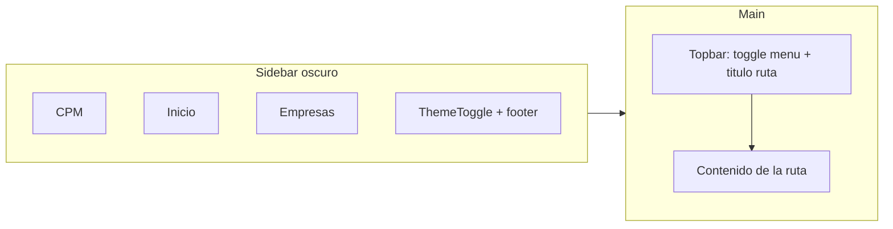
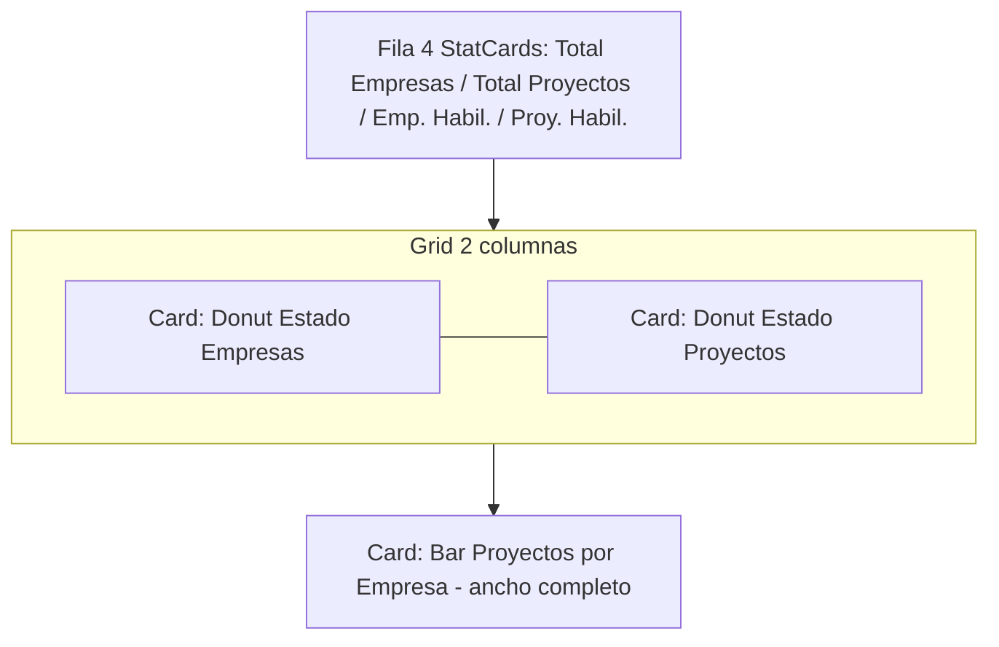
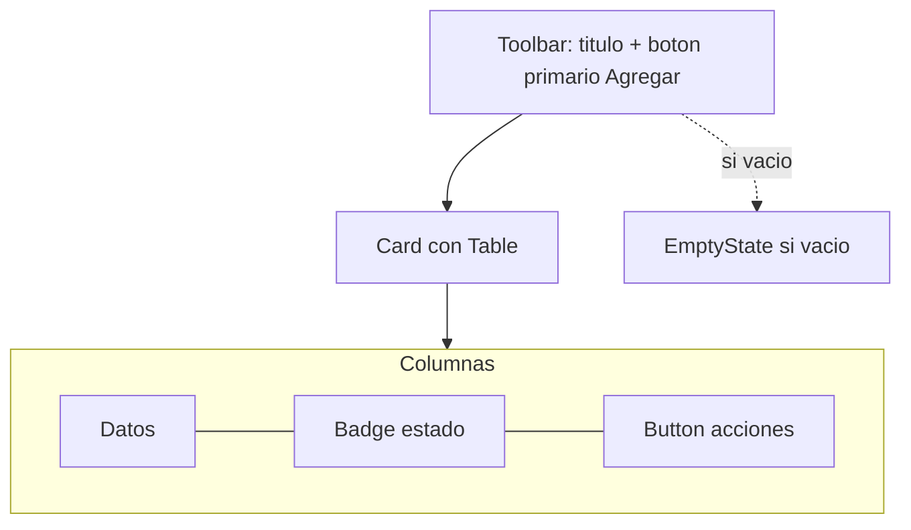

# Rediseño de UI — Dirección B: Modern SaaS (Dark/Light)

Documento de diseño para el rediseño integral del frontend de **Company Project
Management** (kiro-dashboard). Generado con la metodología "Design It Twice" de
la skill `design-an-interface`. La dirección elegida por el usuario es la **B —
Modern SaaS con tema claro/oscuro conmutable**, implementada vía híbrido A→B
(primero tokens + primitivos de bajo riesgo, luego tema dual y primitivos ricos).

## 1. Principios de diseño

1. **Deep module / seam limpio**: toda la apariencia vive en una capa de tokens
   (CSS custom properties) + primitivos reutilizables. Las páginas consumen esa
   interfaz pequeña y obtienen leverage; el mantenimiento tiene locality.
2. **Tema dual por variables**: claro y oscuro se resuelven cambiando el atributo
   `data-theme` en `<html>`. Ningún color se hardcodea en componentes ni gráficas.
3. **No romper contratos**: las props públicas de los componentes existentes y su
   accesibilidad (roles, focus, Escape, aria-labels) se preservan. Los 130 tests
   siguen en verde.
4. **Accesibilidad primero**: contraste AA en ambos temas, focus visible, foco
   atrapado en diálogos, navegación por teclado, `prefers-reduced-motion`.
5. **Responsive**: sidebar colapsable + overlay móvil (breakpoint 1023) se conserva.

## 2. Base técnica

- **Tailwind CSS v4** (plugin `@tailwindcss/vite`). Tokens declarados como CSS
  vars y expuestos a Tailwind con `@theme inline`.
- **class-variance-authority (cva)** para variantes de primitivos.
- **Radix UI** (`@radix-ui/react-dialog`) como base accesible del Dialog/Modal
  (foco atrapado, Escape, aria-*), envuelto para conservar la API actual.
- **clsx** + **tailwind-merge** para componer clases.
- Recharts se re-tematiza leyendo las CSS vars `--chart-*` en runtime.

Versiones se fijarán exactas al instalar (Task 6).

## 3. Design tokens

Los tokens se definen como CSS vars en `:root` (tema claro) y `[data-theme="dark"]`
(tema oscuro). Formato de color en canales HSL para permitir opacidades con Tailwind.

### 3.1 Color — tema claro (`:root`)

| Token | Valor (HSL) | Uso |
|---|---|---|
| `--background` | `210 40% 98%` | Fondo de la app |
| `--foreground` | `222 47% 11%` | Texto principal |
| `--card` | `0 0% 100%` | Superficie de tarjetas/tablas |
| `--card-foreground` | `222 47% 11%` | Texto sobre card |
| `--muted` | `210 40% 96%` | Fondos sutiles (headers de tabla) |
| `--muted-foreground` | `215 16% 47%` | Texto secundario |
| `--border` | `214 32% 91%` | Bordes y divisores |
| `--input` | `214 32% 91%` | Borde de inputs |
| `--primary` | `243 75% 59%` | Acción principal (indigo #4f46e5) |
| `--primary-foreground` | `0 0% 100%` | Texto sobre primary |
| `--ring` | `243 75% 59%` | Anillo de focus |
| `--success` | `142 71% 45%` | Estado habilitado |
| `--success-foreground` | `0 0% 100%` | |
| `--danger` | `0 72% 51%` | Destructivo / deshabilitado |
| `--danger-foreground` | `0 0% 100%` | |
| `--warning` | `38 92% 50%` | Advertencias |
| `--sidebar` | `222 47% 11%` | Fondo del sidebar (oscuro en ambos temas) |
| `--sidebar-foreground` | `210 40% 96%` | Texto del sidebar |
| `--sidebar-active` | `243 75% 59%` | Item activo del sidebar |

### 3.2 Color — tema oscuro (`[data-theme="dark"]`)

| Token | Valor (HSL) | Uso |
|---|---|---|
| `--background` | `222 47% 7%` | Fondo (#0b1120 aprox) |
| `--foreground` | `210 40% 96%` | Texto principal |
| `--card` | `222 47% 11%` | Superficie (#111827 aprox) |
| `--card-foreground` | `210 40% 96%` | |
| `--muted` | `217 33% 17%` | Fondos sutiles |
| `--muted-foreground` | `215 20% 65%` | Texto secundario |
| `--border` | `217 33% 20%` | Bordes |
| `--input` | `217 33% 20%` | |
| `--primary` | `239 84% 74%` | Indigo claro (#818cf8) |
| `--primary-foreground` | `222 47% 11%` | |
| `--ring` | `239 84% 74%` | |
| `--success` | `142 69% 58%` | |
| `--danger` | `0 84% 65%` | |
| `--warning` | `38 92% 60%` | |
| `--sidebar` | `222 47% 5%` | |
| `--sidebar-foreground` | `210 40% 96%` | |
| `--sidebar-active` | `239 84% 74%` | |

### 3.3 Colores de datos (gráficas)

Definidos por tema para garantizar contraste. Reemplazan los colores hardcodeados
(`#22c55e`, `#6b7280`, `#3b82f6`) de las gráficas actuales.

| Token | Claro | Oscuro | Uso |
|---|---|---|---|
| `--chart-1` | `243 75% 59%` | `239 84% 74%` | Serie primaria / barras |
| `--chart-2` | `142 71% 45%` | `142 69% 58%` | Habilitado |
| `--chart-3` | `215 16% 55%` | `215 20% 55%` | Deshabilitado / neutro |
| `--chart-4` | `38 92% 50%` | `38 92% 60%` | Cuarta serie |
| `--chart-grid` | `214 32% 91%` | `217 33% 20%` | Grid / ejes |

### 3.4 Espaciado, radios, tipografía, sombras

| Grupo | Tokens |
|---|---|
| Espaciado (base 4px) | `--space-1:.25rem` … `--space-8:2rem` (usar escala de Tailwind) |
| Radios | `--radius-sm:.375rem`, `--radius-md:.625rem`, `--radius-lg:.875rem`, `--radius-xl:1.125rem` |
| Tipografía | Fuente: system-ui stack actual. Escala: `xs .75`, `sm .875`, `base 1`, `lg 1.125`, `xl 1.375`, `2xl 1.75rem`. Números: `tabular-nums` en métricas |
| Sombras | `--shadow-sm`, `--shadow-md`, `--shadow-lg` (más suaves en dark) |
| Motion | Transiciones 150ms ease; desactivar con `prefers-reduced-motion` |

## 4. Guía de componentes (primitivos)

Cada primitivo es un wrapper delgado que aplica tokens vía Tailwind + cva. Los
componentes existentes se re-implementan **encima** de estos primitivos sin cambiar
sus props públicas.

| Primitivo | Variantes / props | Reemplaza / envuelve |
|---|---|---|
| `Button` | `variant: primary\|secondary\|danger\|ghost`, `size: sm\|md` | `button.primary/.danger/.ghost` |
| `Card` | `Card`, `CardHeader`, `CardBody`, `CardTitle` | `.card`, `.table-card` |
| `Table` | `Table/Thead/Tbody/Tr/Th/Td`, hover, sticky header | `<table>` + `.table-card/.table-scroll` |
| `Badge` | `tone: success\|danger\|warning\|neutral` | `.badge--on/.badge--off` |
| `Dialog` | Radix-based; `open`, `onOpenChange`, `title`, `description` | base de `ConfirmDialog` y form modales |
| `Input` / `Field` | label, error, ayuda | inputs de formularios |
| `Toast` | `tone`, `open`, `onClose`, autodismiss | `Notificacion` (misma API) |
| `Spinner` | `label` | `DashboardLoading` |
| `EmptyState` | `title`, `description`, `action?` | `.empty-state` |
| `StatCard` | `valor`, `etiqueta`, `icono?` | `TarjetaResumen` (misma API) |
| `ThemeToggle` | claro/oscuro, persistido | nuevo |

### Contratos preservados (no cambian)

- `TarjetaResumen({ valor, etiqueta, icono? })`
- `ConfirmDialog({ isOpen, title, message, confirmLabel, cancelLabel, onConfirm, onCancel })` — `role=dialog`, `aria-modal`, focus en cancelar, Escape cierra.
- `Notificacion({ mensaje, tipo:'exito'|'error', visible, onClose })` — `role=alert`, auto-dismiss 4s.
- `DashboardLoading()` — `role=status`.
- `DashboardError({ onRetry, disabled, mensaje })` — `role=alert`.
- `Layout` — sidebar colapsable + overlay móvil, `useIsMobile(1023)`, títulos por ruta, `aria-expanded`/`aria-label` del toggle.
- `EmpresaFormModal`, `ProyectoFormModal` — mismas props.

## 5. Wireframes

### 5.1 Layout general

### 5.2 Dashboard (Home)

### 5.3 Empresas / Proyectos

## 6. Estrategia de implementación (híbrido A→B)

1. **Escalón 1 (bajo riesgo)**: instalar Tailwind v4 + deps; declarar tokens
   (claro y oscuro) en `global.css`; mantener markup actual funcionando. Verificar
   build + 130 tests verdes.
2. **Escalón 2**: crear primitivos con cva/Radix (TDD); migrar componentes
   compartidos conservando su API; luego Layout; luego vistas Empresas y
   Proyectos; luego Dashboard/gráficas; finalmente pulido, a11y y responsive.

Cada paso mantiene los tests en verde (replace-don't-layer: si un test observa
implementación en vez de comportamiento, se ajusta a comportamiento).

## 7. Accesibilidad — checklist

- Contraste AA para texto y componentes en claro y oscuro.
- Focus visible con `--ring` en todos los interactivos.
- Dialogs: foco atrapado, Escape cierra, `aria-modal`, retorno de foco al trigger.
- Toasts: `role=alert`.
- Toggle de tema accesible por teclado con `aria-pressed`/label.
- `prefers-reduced-motion` desactiva transiciones/animaciones.
- Gráficas con texto/leyenda legible en ambos temas.
