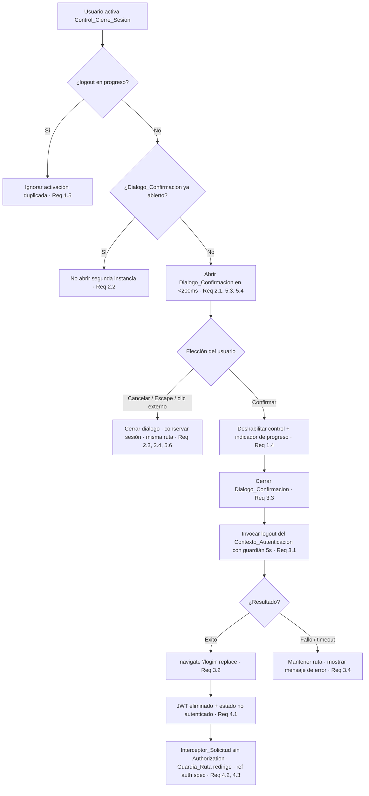

# Documento de Diseño

## Overview

Esta funcionalidad incorpora el cierre de sesión iniciado por el usuario en el `Cliente_Web` (React 19 + TypeScript + Vite). Se apoya íntegramente en la infraestructura de autenticación ya existente definida por la spec `authentication-login-jwt`: el `Contexto_Autenticacion` (`AuthContext`) con su operación `logout`, el `Almacen_Token_Cliente` (`tokenStorage`), el `Interceptor_Solicitud` (`services/api.ts`) y el `Guardia_Ruta` (`ProtectedRoute`). Esta spec **no redefine** el borrado del token ni la protección de rutas; únicamente los orquesta desde la UI.

El diseño introduce un único componente contenedor, `LogoutControl`, responsable de:

1. Renderizar el `Control_Cierre_Sesion` (un botón nativo accesible) dentro del `Contenedor_Layout` (`Layout`), ubicándose en el pie de la barra lateral en escritorio y en la barra superior en móvil (Req 1.1, 1.2, 1.3).
2. Gestionar el estado de UI del flujo: apertura del `Dialogo_Confirmacion`, indicador de progreso y mensaje de error (Req 1.4, 2.x, 3.4).
3. Al confirmar, invocar la operación `logout` del `Contexto_Autenticacion` y redirigir a la `Ruta_Login` mediante `useNavigate` de react-router (Req 3.1, 3.2, 3.3).

### Decisión clave sobre la naturaleza de `logout`

El código real expone `logout()` como **operación síncrona** que llama a `tokenStorage.clear()` (que captura sus propios errores y **no lanza**) y a `setIsAuthenticated(false)`. Los criterios de aceptación, sin embargo, describen "finaliza correctamente", "falla" y "timeout de 5 s" (Req 3.2, 3.4, 4.4).

Para conciliar ambas realidades sin cambiar el contrato ya aprobado de `AuthContext`:

- `LogoutControl` **envuelve** la invocación de `logout` en su propia lógica de resultado. Trata la ausencia de excepción como éxito y cualquier excepción propagada (borde defensivo) como fallo.
- El componente aplica un **guardián de timeout de 5 s** alrededor de la ejecución para cumplir Req 3.4, aunque en la práctica la operación síncrona se resuelve de inmediato. Esto mantiene la robustez si en el futuro `logout` se vuelve asíncrono.
- Como `clear()` nunca lanza, el camino de fallo es un **borde defensivo verificable** (se puede forzar en pruebas mockeando `logout` para que lance), no un flujo habitual. Cumplir Req 3.4 y 4.4 sin sobreingeniería implica capturar el error, cerrar el diálogo, mantener la ruta y mostrar un mensaje.

No se modifica `AuthContext`, `tokenStorage`, `api.ts` ni `ProtectedRoute`.

## Architecture

`LogoutControl` es un componente de presentación con estado local montado dentro de `Layout`. Consume `useAuth()` para acceder a `logout` y `useNavigate()` para la redirección. Reutiliza `ConfirmDialog` (que ya envuelve `ui/Dialog` sobre Radix) para la confirmación accesible.



### Flujo de datos

- **Entrada:** eventos de UI (clic / Enter / Espacio sobre el control; confirmar / cancelar en el diálogo).
- **Efectos:** invocación de `logout` (borra JWT del `Almacen_Token_Cliente` y resetea `isAuthenticated`), navegación a `/login`.
- **Salida visible:** estado del botón (habilitado / deshabilitado + progreso), visibilidad del diálogo, mensaje de error opcional.

Como el cierre de sesión ocurre **dentro** del árbol de componentes de React (a diferencia del `Interceptor_Respuesta` 401, que usa `window.location` porque corre fuera del árbol), la navegación se realiza con `useNavigate` para preservar el estado del router.

## Components and Interfaces

### `LogoutControl` (nuevo)

Ruta propuesta: `frontend/src/components/LogoutControl.tsx`.

Componente único parametrizable por variante de presentación, montado en las dos ubicaciones que exige Req 1.2. Cada instancia se muestra u oculta por CSS según el viewport; la lógica de estado vive en cada instancia de forma independiente y autocontenida.

```typescript
interface LogoutControlProps {
  /**
   * Variante de presentación del Control_Cierre_Sesion.
   * - 'sidebar': se renderiza en el pie de la barra lateral (escritorio, >=1024px).
   * - 'topbar': se renderiza en la barra superior (móvil, <=1023px), siguiendo
   *   el patrón visual de ThemeToggle.
   */
  variant: 'sidebar' | 'topbar';
}
```

Estado interno (React `useState`):

| Estado | Tipo | Propósito | Requisitos |
| --- | --- | --- | --- |
| `isDialogOpen` | `boolean` | Controla la visibilidad del `Dialogo_Confirmacion`. Gatea la apertura de una segunda instancia. | 2.1, 2.2, 2.5 |
| `isLoggingOut` | `boolean` | Indica cierre de sesión en progreso. Deshabilita el control y muestra el indicador; gatea activaciones duplicadas. | 1.4, 1.5 |
| `errorMessage` | `string \| null` | Mensaje de error cuando el `logout` falla o excede el timeout. | 3.4 |

Comportamiento:

- **Activación del control** (`onClick` del botón; Enter/Espacio los maneja el botón nativo → Req 5.3): si `isLoggingOut` es `true`, ignora (Req 1.5); si `isDialogOpen` es `true`, no reabre (Req 2.2); en otro caso pone `isDialogOpen = true` (Req 2.1).
- **Cancelar** (`onCancel` de `ConfirmDialog`, que mapea botón Cancelar, Escape y clic en overlay vía `onOpenChange(false)` de Radix): pone `isDialogOpen = false`, no toca el token ni la ruta (Req 2.3, 2.4, 2.5, 5.6). Radix devuelve el foco al control automáticamente (Req 5.6).
- **Confirmar** (`onConfirm`): cierra el diálogo (`isDialogOpen = false`, Req 3.3), pone `isLoggingOut = true` (Req 1.4) y ejecuta `performLogout()`.
- **`performLogout()`**: envuelve `logout()` en una promesa con guardián de timeout de 5 s (`Promise.race`). En éxito → `navigate('/login', { replace: true })` (Req 3.2). En fallo/timeout → `isLoggingOut = false`, `errorMessage` con texto de fallo, permanece en la ruta actual (Req 3.4, 4.4).

El botón se renderiza con el componente `Button` existente (`variant="ghost"` en sidebar, patrón de icono en topbar) para heredar `focus-visible:ring-2` (Req 5.2) y `disabled:opacity-50` (Req 1.4). Atributos accesibles: texto visible "Cerrar sesión" (Req 1.1, 5.1) y `aria-label` explícito cuando la variante topbar muestre solo icono.

Uso de `ConfirmDialog`:

```tsx
<ConfirmDialog
  isOpen={isDialogOpen}
  title="Cerrar sesión"
  message="¿Seguro que quieres cerrar sesión?"
  confirmLabel="Cerrar sesión"
  cancelLabel="Cancelar"
  onConfirm={handleConfirm}
  onCancel={handleCancel}
/>
```

Se sobrescriben las etiquetas por defecto (`confirmLabel='Eliminar'`) por labels propios de logout. `ConfirmDialog`/`ui/Dialog` sobre Radix aportan sin código adicional: foco atrapado (Req 5.5), traslado de foco al primer interactivo (Req 5.4), cierre con Escape y clic externo tratados como cancelación (Req 2.4), retorno de foco al control (Req 5.6) y `aria-modal`.

### Integración en `Layout` (modificación)

`Layout.tsx` monta dos instancias de `LogoutControl`:

- `<LogoutControl variant="sidebar" />` dentro de `sidebar__footer` (pie del sidebar) → visible en escritorio (Req 1.2). En estado colapsado el footer se oculta por CSS; la instancia topbar cubre la accesibilidad en pantallas estrechas.
- `<LogoutControl variant="topbar" />` en la `topbar`, junto a `ThemeToggle` tras el `topbar__spacer` → visible en móvil (Req 1.2, 1.3).

La conmutación de visibilidad por viewport (>=1024 / <=1023) se resuelve con clases utilitarias/`useIsMobile(1023)` ya presente, garantizando que en móvil el control permanezca dentro del viewport, sin scroll horizontal y enfocable por teclado (Req 1.3).

### Componentes reutilizados sin cambios

| Componente | Rol | Referencia |
| --- | --- | --- |
| `AuthContext` / `useAuth` | Provee `logout` (borra JWT, resetea estado). | Req 3.1, 4.1 |
| `tokenStorage.clear()` | Borra el JWT; captura errores, no lanza. | Req 4.1, 4.4 |
| `services/api.ts` (Interceptor_Solicitud) | Tras el borrado, envía solicitudes sin `Authorization`. | Req 4.2 (ref auth spec) |
| `ProtectedRoute` (Guardia_Ruta) | Redirige rutas protegidas a `/login` sin token. | Req 4.3 (ref auth spec) |
| `ConfirmDialog` + `ui/Dialog` (Radix) | Confirmación accesible y modal. | Req 2.x, 5.4–5.6 |

## Data Models

No hay backend ni entidades persistentes nuevas: el cierre de sesión es una operación de cliente sobre estado ya existente. Los únicos modelos son estados efímeros de UI, encapsulados en `LogoutControl`:

```typescript
/** Estado de UI del flujo de cierre de sesión (efímero, en memoria). */
interface LogoutUIState {
  isDialogOpen: boolean;      // Dialogo_Confirmacion visible
  isLoggingOut: boolean;      // Cierre de sesión en progreso
  errorMessage: string | null; // Mensaje de fallo/timeout, si aplica
}
```

El estado de sesión persistente (JWT en `Almacen_Token_Cliente` y `isAuthenticated` en memoria) es propiedad del `Contexto_Autenticacion`; `LogoutControl` solo lo modifica indirectamente a través de `logout`.

## Correctness Properties

*Una propiedad es una característica o comportamiento que debe cumplirse en todas las ejecuciones válidas del sistema: esencialmente, una afirmación formal sobre lo que el sistema debe hacer. Las propiedades sirven de puente entre las especificaciones legibles por humanos y las garantías de corrección verificables por máquina.*

La mayoría de criterios de esta spec son de renderizado, posicionamiento responsive, umbrales de rendimiento o comportamiento provisto por Radix (accesibilidad), por lo que se cubren con pruebas de ejemplo/smoke (ver Testing Strategy). Las propiedades siguientes capturan la lógica propia de `LogoutControl` que sí varía con la secuencia de eventos y merece verificación universal. Se derivan de la reflexión de prework, que consolidó los criterios testables (1.5+3.1, 2.5+2.3, 2.2, 3.2+3.4).

### Property 1: Invocación única de `logout`

*Para toda* secuencia de una o más activaciones del `Control_Cierre_Sesion` seguida de una o más confirmaciones dentro de un mismo flujo de cierre de sesión, la operación `logout` del `Contexto_Autenticacion` se invoca **a lo sumo una vez** (y exactamente una vez cuando existe al menos una confirmación válida), sin iniciarse un nuevo proceso mientras uno está en progreso.

**Validates: Requirements 1.5, 3.1**

### Property 2: Gating del borrado por confirmación

*Para toda* secuencia de eventos de UI que **no** incluya una confirmación (activaciones repetidas, cancelaciones, Escape, clic externo, apertura/cierre del diálogo en cualquier orden), la operación `logout` **nunca** se invoca y el JWT permanece intacto en el `Almacen_Token_Cliente`, conservándose la sesión y la ruta actual.

**Validates: Requirements 2.3, 2.5**

### Property 3: A lo sumo un diálogo de confirmación

*Para toda* secuencia de N>=1 activaciones consecutivas del `Control_Cierre_Sesion`, existe **como máximo una** instancia del `Dialogo_Confirmacion` de cierre de sesión renderizada simultáneamente.

**Validates: Requirements 2.2**

### Property 4: Redirección condicionada al resultado

*Para todo* resultado de la operación `logout`, la navegación a la `Ruta_Login` (`/login`, con `replace`) ocurre **si y solo si** `logout` finalizó con éxito: en éxito se navega exactamente una vez; ante fallo o expiración del guardián de 5 s no se navega, el `Dialogo_Confirmacion` queda cerrado y se muestra un mensaje de error, permaneciendo el usuario en la ruta actual.

**Validates: Requirements 3.2, 3.4**

## Error Handling

| Escenario | Detección | Respuesta | Requisitos |
| --- | --- | --- | --- |
| `logout` propaga una excepción (borde defensivo; `clear()` no lanza en la práctica) | `try/catch` alrededor de la invocación en `performLogout` | No navegar; `isLoggingOut=false`; `errorMessage` con texto de fallo; cerrar diálogo; permanecer en la ruta | 3.4, 4.4 |
| `logout` no finaliza en 5 s | `Promise.race` entre `logout` y un timeout de 5 s | Igual que el caso de fallo: no navegar, mostrar mensaje de error, cerrar diálogo, mantener ruta | 3.4 |
| Fallo al borrar el JWT dentro del contexto (JWT residual) | Responsabilidad del `Contexto_Autenticacion` (spec auth) | El comportamiento observable lo determina `AuthContext`: mantener no autenticado e ignorar el JWT residual; `LogoutControl` no reintroduce el token | 4.4 (ref auth spec) |
| Activación duplicada durante el progreso | Guardián `isLoggingOut` | Ignorar la activación adicional | 1.5 |
| Reapertura del diálogo estando abierto | Guardián `isDialogOpen` | No abrir una segunda instancia | 2.2 |

El mensaje de error se renderiza de forma accesible (texto asociado al control, con `role="alert"` o región live), sin bloquear la interfaz. Tras un fallo, el usuario puede reintentar activando de nuevo el control.

**Nota sobre Req 4.4 vs Req 3.4:** ambos describen la rama de fallo. Req 3.4 (fallo genérico de la operación) mantiene al usuario en la ruta actual con mensaje de error; Req 4.4 (fallo específico al borrar el JWT) delega en el contrato de `AuthContext`, que ya deja al usuario como no autenticado. Como `tokenStorage.clear()` captura sus errores y `logout` no lanza, el estado no autenticado se alcanza de forma consistente; `LogoutControl` no introduce comportamiento que contradiga la spec de autenticación.

## Testing Strategy

Herramientas: **Vitest** + **@testing-library/react** + **@testing-library/user-event** para pruebas de ejemplo e integración; **fast-check** (ya presente en el proyecto) para las pruebas de propiedad.

### Pruebas de propiedad (fast-check, mínimo 100 iteraciones)

Cada propiedad se implementa con una **única** prueba de propiedad, etiquetada en un comentario con el formato requerido. `logout` y `useNavigate` se mockean para aislar la lógica de `LogoutControl` y mantener bajo el coste de las 100+ iteraciones.

- **Property 1** — generar N (1..10) activaciones y M (1..10) confirmaciones intercaladas; assert de `logout` llamado a lo sumo una vez (exactamente una si M>=1) y `navigate` a lo sumo una vez.
  `// Feature: user-logout, Property 1: Para toda secuencia de activaciones y confirmaciones, logout se invoca a lo sumo una vez`
- **Property 2** — generar secuencias aleatorias de eventos sin confirmación (activar, cancelar, Escape, clic externo, reabrir); assert de `logout` nunca llamado y token intacto.
  `// Feature: user-logout, Property 2: Sin confirmación, logout nunca se invoca y el JWT permanece intacto`
- **Property 3** — generar N (1..10) activaciones consecutivas; assert de a lo sumo un elemento con `role="dialog"`.
  `// Feature: user-logout, Property 3: Para N activaciones, existe a lo sumo un Dialogo_Confirmacion`
- **Property 4** — generar el resultado de `logout` (éxito | excepción | timeout) como input; assert de que `navigate('/login', {replace:true})` ocurre si y solo si el resultado es éxito, y de que en fallo/timeout hay mensaje de error y el diálogo está cerrado.
  `// Feature: user-logout, Property 4: navigate('/login') ocurre si y solo si logout tuvo éxito`

Configuración: `fc.assert(fc.property(...), { numRuns: 100 })` como mínimo por prueba.

### Pruebas de ejemplo (unit / interacción)

- Render: control presente con nombre accesible "Cerrar sesión" (Req 1.1, 5.1).
- Posicionamiento por viewport con `matchMedia` simulado: instancia sidebar en escritorio, instancia topbar en móvil (Req 1.2, 1.3).
- Activación abre el `Dialogo_Confirmacion` (Req 2.1); con teclado Enter/Espacio (Req 5.3).
- Confirmar: botón deshabilitado + indicador de progreso (Req 1.4); diálogo cerrado antes de navegar (Req 3.3).
- Cancelación por botón, Escape y clic en overlay: diálogo cerrado, sesión conservada, foco de vuelta al control (Req 2.3, 2.4, 5.6).
- Foco al abrir cae dentro del diálogo (Req 5.4).

### Pruebas de integración

- Con `AuthProvider` real y token sembrado: confirmar → token ausente y `isAuthenticated=false` (Req 4.1).
- Referencia a la spec `authentication-login-jwt` para la ausencia de `Authorization` en solicitudes posteriores (Req 4.2) y la redirección del `Guardia_Ruta` (Req 4.3); se cubren con smoke opcional, no se reimplementan aquí.

### Smoke / verificación manual

- Contraste del indicador de foco >=3:1 (Req 5.2): verificación visual; se confía en `focus-visible:ring-2` del `Button`.
- Focus trap del diálogo (Req 5.5): provisto por Radix; smoke opcional de tabulación cíclica.

## Decisiones de diseño clave

| Decisión | Motivación | Requisitos |
| --- | --- | --- |
| Un único componente `LogoutControl` con dos variantes (`sidebar`/`topbar`) montado en ambos lugares, con visibilidad por viewport | Cumplir la ubicación responsive sin duplicar lógica de estado ni romper el `Layout` existente | 1.1, 1.2, 1.3 |
| Reutilizar `ConfirmDialog`/`ui/Dialog` (Radix) en lugar de implementar modal/focus trap propio | Radix ya aporta foco atrapado, Escape, clic externo como cierre, `aria-modal` y retorno de foco | 2.1, 2.4, 5.4, 5.5, 5.6 |
| Sobrescribir labels del `ConfirmDialog` (`confirmLabel="Cerrar sesión"`) | El componente es genérico (por defecto "Eliminar"); el logout necesita labels propios | 2.1, 3.1 |
| Guardián `isLoggingOut` para deduplicar activaciones y `isDialogOpen` para evitar segunda instancia | Prevenir procesos duplicados y diálogos múltiples | 1.5, 2.2 |
| Envolver `logout` con manejo de resultado y guardián de timeout de 5 s en `LogoutControl`, sin cambiar el contrato síncrono de `AuthContext` | Conciliar el `logout` síncrono real con los criterios de "finaliza/falla/timeout" sin sobreingeniería | 3.2, 3.4, 4.4 |
| Navegar con `useNavigate('/login', { replace:true })` en lugar de `window.location` | El logout ocurre dentro del árbol de React; preserva el estado del router (a diferencia del interceptor 401) | 3.2 |
| No modificar `AuthContext`, `tokenStorage`, `api.ts` ni `ProtectedRoute` | El borrado del token, el interceptor y la protección de rutas ya están definidos en la spec de autenticación | 4.1, 4.2, 4.3 |
