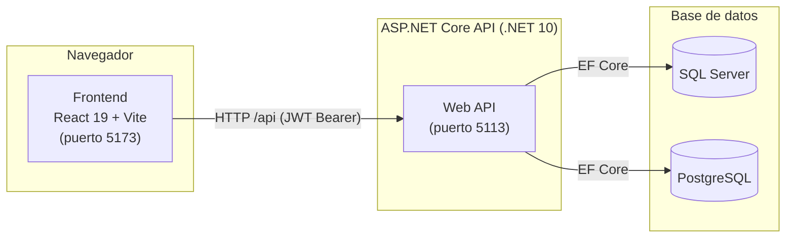
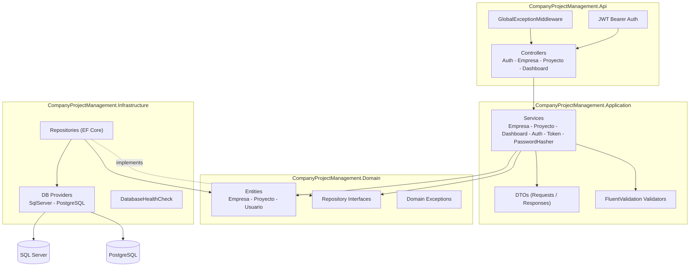
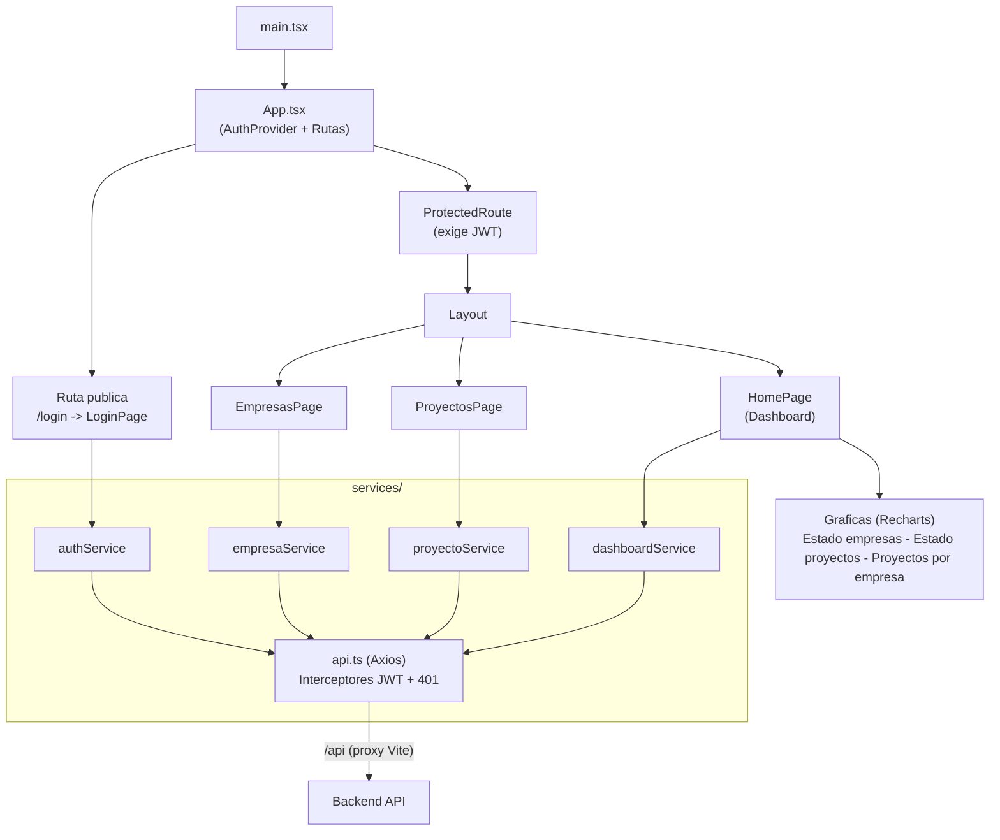
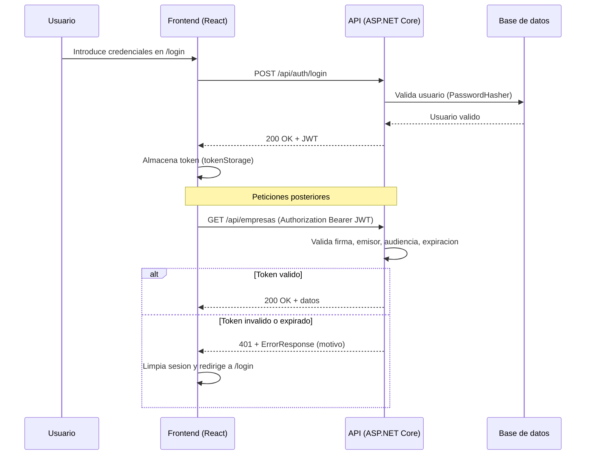

# Company Project Management Dashboard

Aplicacion full-stack para la gestion de empresas y sus proyectos, con autenticacion basada en JWT y un dashboard de estadisticas. El backend esta construido con ASP.NET Core (.NET 10) siguiendo una arquitectura limpia por capas, y el frontend con React 19 + Vite + TypeScript.

---

## Tabla de contenidos

- [Stack tecnologico](#stack-tecnologico)
- [Estructura del repositorio](#estructura-del-repositorio)
- [Requisitos previos](#requisitos-previos)
- [Instalacion y ejecucion](#instalacion-y-ejecucion)
- [Configuracion](#configuracion)
- [Arquitectura](#arquitectura)
- [API REST](#api-rest)
- [Pruebas](#pruebas)

---

## Stack tecnologico

### Backend
- .NET 10 / ASP.NET Core Web API
- Entity Framework Core 10 (SQL Server y PostgreSQL)
- Autenticacion JWT (Microsoft.AspNetCore.Authentication.JwtBearer)
- FluentValidation
- OpenAPI (Microsoft.AspNetCore.OpenApi)

### Frontend
- React 19 + React DOM
- Vite 6 + TypeScript 5.8
- React Router DOM 7
- Axios (cliente HTTP)
- Tailwind CSS 4 + Radix UI + lucide-react
- Recharts (graficas del dashboard)
- Zod (validacion de esquemas)
- Vitest + Testing Library + fast-check (pruebas)

---

## Estructura del repositorio

```
kiro-dashboard/
|- backend/
|  |- CompanyProjectManagement.slnx
|  \- src/
|     |- CompanyProjectManagement.Api/               # Controladores, middleware, arranque
|     |- CompanyProjectManagement.Application/       # Servicios, DTOs, validadores, opciones
|     |- CompanyProjectManagement.Domain/            # Entidades, excepciones, contratos de repositorio
|     |- CompanyProjectManagement.Infrastructure/    # EF Core, repositorios, proveedores de BD
|     |- CompanyProjectManagement.Infrastructure.Common/
|     |- CompanyProjectManagement.Infrastructure.PostgreSQL/
|     \- CompanyProjectManagement.Infrastructure.SqlServer/
\- frontend/
   \- src/
      |- components/    # Componentes reutilizables (Layout, modales, graficas, rutas protegidas)
      |- context/       # Contexto de autenticacion
      |- hooks/         # Hooks personalizados
      |- pages/         # Paginas (Login, Home, Empresas, Proyectos)
      |- schemas/       # Esquemas de validacion (Zod)
      |- services/      # Cliente Axios y servicios de API
      |- types/         # Tipos TypeScript
      \- utils/         # Utilidades (almacenamiento de token, etc.)
```

---

## Requisitos previos

- .NET SDK 10.0 o superior
- Node.js 20 o superior + npm
- Un motor de base de datos: SQL Server o PostgreSQL

---

## Instalacion y ejecucion

### Backend

```bash
cd backend
dotnet restore                                        # Restaurar dependencias
dotnet build                                          # Compilar la solucion
dotnet run --project src/CompanyProjectManagement.Api # Ejecutar la API
```

La API queda disponible en:
- HTTP: http://localhost:5113
- HTTPS: https://localhost:7282
- OpenAPI (solo en entorno Development): http://localhost:5113/openapi/v1.json

> El arranque valida la conectividad con la base de datos y la configuracion JWT.
> Si faltan Jwt:SecretKey, Jwt:Issuer o Jwt:Audience, la aplicacion no arranca.

### Frontend

```bash
cd frontend
npm install       # Instalar dependencias
npm run dev       # Servidor de desarrollo (http://localhost:5173)
npm run build     # Compilar para produccion
npm run preview   # Previsualizar el build de produccion
```

El servidor de desarrollo de Vite corre en el puerto 5173 y hace proxy de las peticiones /api hacia el backend en http://127.0.0.1:5113.

---

## Configuracion

La configuracion del backend vive en backend/src/CompanyProjectManagement.Api/appsettings.json.

| Clave | Descripcion |
|-------|-------------|
| DatabaseProvider | Proveedor activo: SqlServer o PostgreSQL |
| ConnectionStrings:SqlServer | Cadena de conexion de SQL Server |
| ConnectionStrings:PostgreSQL | Cadena de conexion de PostgreSQL |
| Jwt:Issuer | Emisor del token |
| Jwt:Audience | Audiencia del token |
| Jwt:ExpirationMinutes | Minutos de vigencia del token |
| Jwt:SecretKey | Clave secreta de firma del JWT |

> Seguridad: no guardes secretos reales (Jwt:SecretKey, contrasenas de BD) en el control de versiones. Usa user-secrets o variables de entorno en produccion.

El frontend apunta al backend mediante baseURL: /api (ver frontend/src/services/api.ts), resuelto por el proxy de Vite en desarrollo.

---

## Arquitectura

### Vista general del sistema



### Arquitectura del backend

El backend sigue una arquitectura limpia por capas, con dependencias que apuntan hacia el dominio. La capa de infraestructura selecciona el proveedor de BD en tiempo de ejecucion.



**Capas:**
- Domain - Entidades del negocio (Empresa, Proyecto, Usuario), interfaces de repositorio y excepciones. Sin dependencias externas.
- Application - Casos de uso (servicios), DTOs, validadores (FluentValidation) y opciones (JWT). Depende solo del dominio.
- Infrastructure - Implementacion de repositorios con EF Core, seleccion de proveedor de BD (SQL Server / PostgreSQL) y verificacion de salud.
- Api - Controladores REST, middleware global de excepciones, autenticacion JWT Bearer y arranque (Program.cs).

### Arquitectura del frontend



**Puntos clave:**
- App.tsx define las rutas y envuelve todo en AuthProvider.
- ProtectedRoute bloquea las rutas privadas y redirige a /login sin token.
- services/api.ts centraliza el cliente Axios: un interceptor de solicitud adjunta el Bearer token y un interceptor de respuesta maneja los 401 (limpia sesion y redirige a /login, deduplicando multiples 401 concurrentes).
- El dashboard usa Recharts para las graficas de estadisticas.

### Flujo de autenticacion



---

## API REST

Todas las rutas salvo login requieren el encabezado Authorization: Bearer <JWT>.

| Metodo | Ruta | Descripcion | Auth |
|--------|------|-------------|:----:|
| POST | /api/auth/login | Inicio de sesion (obtiene JWT) | No |
| GET | /api/empresas | Listar empresas | Si |
| POST | /api/empresas | Crear empresa | Si |
| GET | /api/empresas/{id} | Obtener empresa por id | Si |
| PUT | /api/empresas/{id} | Actualizar empresa | Si |
| DELETE | /api/empresas/{id} | Eliminar empresa | Si |
| GET | /api/empresas/{empresaId}/proyectos | Listar proyectos de una empresa | Si |
| POST | /api/empresas/{empresaId}/proyectos | Crear proyecto | Si |
| GET | /api/empresas/{empresaId}/proyectos/{proyectoId} | Obtener proyecto por id | Si |
| PUT | /api/empresas/{empresaId}/proyectos/{proyectoId} | Actualizar proyecto | Si |
| DELETE | /api/empresas/{empresaId}/proyectos/{proyectoId} | Eliminar proyecto | Si |
| GET | /api/dashboard/estadisticas | Estadisticas del dashboard | Si |

---

## Pruebas

### Backend

```bash
cd backend
dotnet test
```

### Frontend

```bash
cd frontend
npm run test        # Ejecucion unica
npm run test:watch  # Modo watch
```
